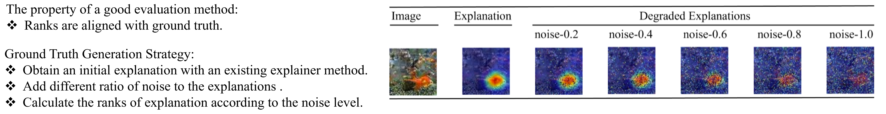
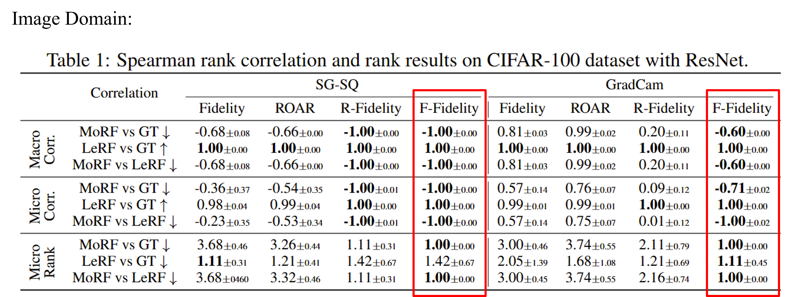

## Finetune Fidelity ( F-Fidelity )  [[paper]](https://openreview.net/pdf?id=X0r4BN50Dv) [[code]](https://github.com/AslanDing/Finetune-Fidelity) 

### Abstract
Recent research has developed a number of eXplainable AI (XAI) techniques, such as gradient-based approaches, input perturbation-base methods, and black-box explanation methods.
While these XAI techniques can extract meaningful insights from deep learning models, how to properly evaluate them remains an open problem.  
The most widely used approach is to perturb or even remove what the XAI method considers to be the most important features in an input and observe the changes in the output prediction.
This approach, although straightforward, suffers the Out-of-Distribution(OOD) problem as the perturbed samples may no longer follow the original data distribution. 
A recent method RemOve And Retrain (ROAR) solves the OOD issue by retraining the model with perturbed samples guided by explanations. 
However, using the model retrained based on XAI methods to evaluate these explainers may cause information leakage and thus lead to unfair comparisons.  
We propose Fine-tuned Fidelity , a robust evaluation framework for XAI, which utilizes i) an explanation-agnostic fine-tuning strategy, thus mitigating the information leakage issue, and ii) a random masking operation that ensures that the removal step does not generate an OOD input.
We also design controlled experiments with state-of-the-art (SOTA) explainers and their degraded version to verify the correctness of our framework.
We conduct experiments on multiple data modalities, such as images, time series, and natural language. The results demonstrate that $F-Fidelity$ significantly improves upon prior evaluation metrics in recovering the ground-truth ranking of the explainers. 
Furthermore, we show both theoretically and empirically that, given a faithful explainer, $F-Fidelity$ metric can be used to compute the sparsity of influential input components, i.e., to extract the true explanation size. 

### Explaining Deep Learning Models
In XAI, we first consider the attribution importance score as the explanation, indiating which part is important for deep learning model. For example, in image classification, the foreground is more important than background. For time series, the temporal pattern contains more information than random noise.
<div style="display: flex; justify-content: center;">
<table>
  <tr>
    <td>  </td>
  </tr>
 </table>
</div>


### Evaluation Strategy
How to evaluate the explanation method is a challenge. The evaluation methods can be divided into two categories, groundtruth-based and groundtruth-free.  

Groundtruth-based methods are using the explanation ground truth to make comparison. In an image or sentence, it is for humans to understand the context concepts and know if the explanations are correct. However, in the graph and time series domain, humans extract context concepts hard. A tactical way is to compare ground truth with explanation results, so some common metrics, such as accuracy, recall, AUC, and etc, can be easily transferred to explainable AI. In graph explanation methods, some synthetic datasets, such as ba2shapes, and ba2motifs, are introduced to evaluate the explanation methods. 

Groundtruth-free methods are measure the explanation from the aspects of robustness, faithfulness, and so on. In this project, we consider the faithfulness, which measure if the explantion is faithful to the prediction.
<div style="display: flex; justify-content: center;">
<table>
  <tr>
    <td>  </td>
  </tr>
 </table>
</div>

### Fidelity and OOD Problems
To evaluate the faithfulness of the explanation methods, the Fidelity method are introduced. The tuitive idea is if the explanation part is critical for the prediction model, the model can infer the results from explanation. On the contrary, the non-explanation part will cause the shifts of pridiction. We follow the previous paper [Robust Fidelity(R-Fidelity)](https://trustai4s-lab.github.io/fidelity.html) to use Fidelity as the basic metric.
<div style="display: flex; justify-content: center;">
<table>
  <tr>
    <td>  </td>
  </tr>
 </table>
</div>

Accoriding to the metric of evaluation, we can have two kinds of fidelity, Probability-Based Fidelity and Accuracy-Based Fidelity.
<div style="display: flex; justify-content: center;">
<table>
  <tr>
    <td>  </td>
  </tr>
 </table>
</div>

According to Fidelity definition, there exists Out-of-Distribution(OOD) problem might cause inaccurate results because of the domain shift between original training data and explanation data. In previous paper, Remove and Retrain(ROAR) introduces retrain to avoid the OOD problem. However, it suffers the leakage of label information.
<div style="display: flex; justify-content: center;">
<table>
  <tr>
    <td>  </td>
  </tr>
 </table>
</div>
<!-- <center class="ood">
<table>
  <tr>
    <td> </td>
  </tr>
 </table>
</center> -->


### Finetune Fidelity
In this paper, we propose Finetune Fidelity(F-Fidelity), extend from R-Fidelity. We use two proxy strategies to approximate the Fidelity results without OOD. First, we follow  R-Fidelity to use a proxy sampling strategy to allievate the OOD problem in evaluation. Second, we introudce another finetune stage to obatin a proxy model for evaluation. Our framework can be summarized as follow:
<div style="display: flex; justify-content: center;">
<table>
  <tr>
    <td>  </td>
  </tr>
 </table>
</div>
<!-- <center class="ffid">
<table>
  <tr>
    <td> </td>
  </tr>
 </table>
</center> -->

During finetune stage, we use a hyperparameter $\beta$ to generate augmentations(random delete at most $\beta$ ratio in this paper). In the evalation stage, we use another hyperparameter $\alpha$ to sample the part will be deleted according to the explanation. If the delted part is more than $\beta$, then only $\beta$ will be deleted. 


### Experiments
We conduct experiments on three domains, image, time series, and NLP.  We first obtain initial explanations from an explainer. Then degared explanations are obatined by adding different level of random noise. A good evaluation metric should report consistent ranks aligned with the level of noise. 
<div style="display: flex; justify-content: center;">
<!-- <center class="GT"> -->
<table>
  <tr>
    <!-- <td> </td> -->
    <td>  </td>
  </tr>
 </table>
<!-- </center> -->
</div>


From the results, we observe our method generate consistent results than baselines with OOD problem. Without OOD, our method also achieve comparable results.  

<center class="results">
<table>
  <tr>
    <td> </td>
</tr>
  <tr>
    <td> </td>
    </tr>
  <tr>
    <td> </td>
</tr>
 </table>
</center>

We also provide case study results on real-world dataset.
<center class="case_results">
<table>
  <tr>
    <td> </td>
</tr>
  <tr>
    <td> </td>
    </tr>
 </table>
</center>


### If this work is helpful for you, please consider citing our paper.
```angular2html
@inproceedings{
zheng2025ffidelity,
title={F-Fidelity: A Robust Framework for Faithfulness Evaluation of Explainable {AI}},
author={Xu Zheng and Farhad Shirani and Zhuomin Chen and Chaohao Lin and Wei Cheng and Wenbo Guo and Dongsheng Luo},
booktitle={The Thirteenth International Conference on Learning Representations},
year={2025},
url={https://openreview.net/forum?id=X0r4BN50Dv}
}
```
