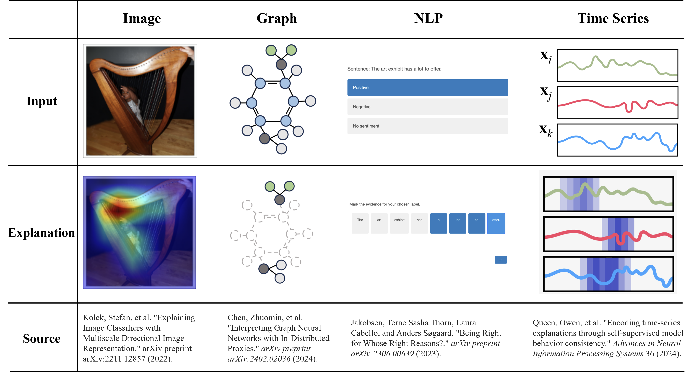
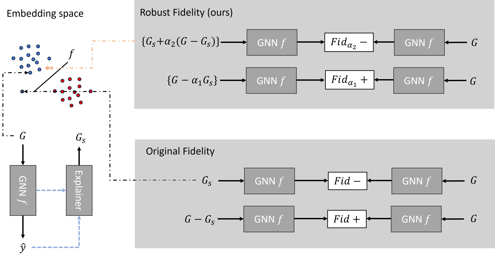

## Robust fidelity ( Fidα )  [[paper]](https://openreview.net/pdf?id=up6hr4hIQH) [[code]](https://github.com/AslanDing/Fidelity) 

### Abstract
This paper studies this foundational challenge, spotlighting the inherent limitations of prevailing fidelity metrics, including  $Fid_+$, $Fid_−$, and $Fid_\Delta$. Specifically, a formal, information-theoretic definition of explainability is introduced and it is shown that existing metrics often fail to align with this definition across various statistical scenarios. The reason is due to potential distribution shifts when subgraphs are removed in computing these fidelity measures. 
Subsequently, a robust class of fidelity measures are introduced, and it is shown analytically that they are resilient to distribution shift issues and are applicable in a wide range of scenarios. Extensive empirical analysis on both synthetic and real datasets are provided to illustrate that the proposed metrics are more coherent with gold standard metrics.

### Explainable methods
Explainable AI help us to understand how the model make prediction. The following figure shows some explain methods. In graph domain, an explanation is usually a subgraph, such as NH$_2$ and NO$_2$ in Mutag dataset. In NLP tasks, the explanations are the most important words. For time series, the explanations are the time stamps. In a image, the explanation is the foreground that the model focus on. In current paper, we first introduce our method on graph domain.
 
<center class="ba2">
<table>
  <tr>
    <td> </td>
  </tr>
 </table>
</center>


### Metric
How to evaluate the explanation method is a challenge due to some problem sucha as lacking of groundtruth, multi-motifs and etc. In an image or sentance, it is for human to understand the context concepts and know if the explanations are correct. However, in graph and time series domain, human extract context concepts hard. A tuitive way is to compare ground truth with explanation results, so some common metrics, such as accuracy, recall, AUC, and etc, can be easily tranfer to explainable AI. In graph explanation methods, some synthetic datasets, such as ba2shapes,ba2motifs, are introduced to evaluate the explanation methods. The shortcoming of this metric is obveriously. The real world datasets are more complex than synthetic datasets and hard to obtain groundtruth.

To evaluate the faithfulness of the explanation methods, the Fidelity method are introduced. The tuitive idea is if the explanation part is critical for the prediction model, the model can infer the results from explanation. On the contrary, the non-explanation part will cause the shifts of pridiction. Based on this idea, we can have $Fid+, Fid-, Fid_\Delta$. Formally, we have：

<center class="ba2">
<table>
  <tr>
    <td> </td>
  </tr>
 </table>
</center>

Fidelity provide another method to evaluate the fithfulness of the explanation, which can be applied to real world datasets. 


### Fidelity and OOD Problems.
We illustrate to understand how our method works.

<center class="ba2">
<table>
  <tr>
    <td> </td>
  </tr>
 </table>

</center>

### Robust Fidelity


### Experiments
#### Probability ori. Fidelity results of Ba2Motifs dataset, the x-axis means adding non-explanation edges to GT, y-axis means remove edges from GT. The following three figures are Original Fid+, Fid−, and Fid∆.

<center class="ba2">
<table>
  <tr>
    <td> </td>
    <td></td>
    <td></td>
  </tr>
 </table>

</center>


#### Probability our Fidelity results of Ba2Motifs dataset. The following three figures are Ours Fid+, Fid−, and Fid∆.
<center class="ba2">

<table>
  <tr>
    <td> </td>
    <td></td>
    <td></td>
  </tr>
 </table>
</center>

#### Probability ori. Fidelity results of TreeCycles dataset. The following three figures are Original Fid+, Fid−, and Fid∆.
<center class="ba2">
<table>
  <tr>
    <td> </td>
    <td></td>
    <td></td>
  </tr>
 </table>
</center>

#### Probability our Fidelity results of TreeCycles dataset. The following three figures are Ours Fid+, Fid−, and Fid∆.
<center class="ba2">

<table>
  <tr>
    <td> </td>
    <td></td>
    <td></td>
  </tr>
 </table>
</center>


### If this work is helpful for you, please consider citing our paper.

```angular2html
@article{zheng2023towards,
  title={Towards robust fidelity for evaluating explainability of graph neural networks},
  author={Zheng, Xu and Shirani, Farhad and Wang, Tianchun and Cheng, Wei and Chen, Zhuomin and Chen, Haifeng and Wei, Hua and Luo, Dongsheng},
  journal={arXiv preprint arXiv:2310.01820},
  year={2023}
}
```

