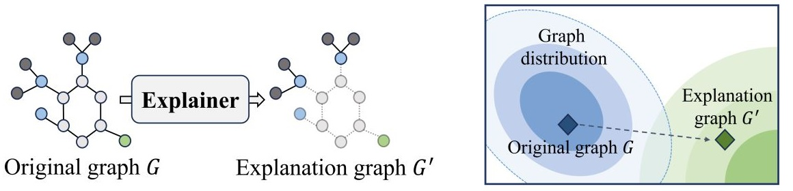

## Robust Fidelity ( Fidα )  [[paper]](https://openreview.net/pdf?id=up6hr4hIQH) [[code]](https://github.com/AslanDing/Fidelity) 

### Abstract
This paper studies this foundational challenge, spotlighting the inherent limitations of prevailing fidelity metrics, including  $Fid_+$, $Fid_−$, and $Fid_\Delta$. Specifically, a formal, information-theoretic definition of explainability is introduced and it is shown that existing metrics often fail to align with this definition across various statistical scenarios. The reason is due to potential distribution shifts when subgraphs are removed in computing these fidelity measures. 
Subsequently, a robust class of fidelity measures are introduced, and it is shown analytically that they are resilient to distribution shift issues and are applicable in a wide range of scenarios. Extensive empirical analysis on both synthetic and real datasets are provided to illustrate that the proposed metrics are more coherent with gold standard metrics.

### Explaining Deep Learning Models
Explainable AI helps us to understand how the model makes predictions. The following figure shows some explained methods. In the graph domain, an explanation is usually a subgraph, such as NH$_2$ and NO$_2$ in the Mutag dataset. In NLP tasks, the explanations are the most important words. For time series, the explanations are the time stamps. In an image, the explanation is the foreground that the model focuses on. In the current paper, we first introduce our method on the graph domain.
 
<center class="explain">
<table>
  <tr>
    <td> </td>
  </tr>
 </table>
</center>

<!---
### Metric
How to evaluate the explanation method is a challenge due to some problems such as lack of ground truth, multi-motifs and etc. In an image or sentence, it is for humans to understand the context concepts and know if the explanations are correct. However, in the graph and time series domain, humans extract context concepts hard. A tactical way is to compare ground truth with explanation results, so some common metrics, such as accuracy, recall, AUC, and etc, can be easily transferred to explainable AI. In graph explanation methods, some synthetic datasets, such as ba2shapes, and ba2motifs, are introduced to evaluate the explanation methods. The shortcoming of this metric is obvious. The real-world datasets are more complex than synthetic datasets and hard to obtain ground truth.
-->

### Fidelity and OOD Problems.
To evaluate the faithfulness of the explanation methods, the Fidelity method are introduced. The tuitive idea is if the explanation part is critical for the prediction model, the model can infer the results from explanation. On the contrary, the non-explanation part will cause the shifts of pridiction. Based on this idea, we can have $Fid+, Fid-, Fid_\Delta$. Formally, we have：

<center class="metric">
<table>
  <tr>
    <td> </td>
  </tr>
 </table>
</center>

<!--
Fidelity provides another method to evaluate the faithfulness of the explanation, which can be applied to real-world datasets. 
-->

According to Fidelity definition, there exists Out-of-Distribution(OOD) problem might cause inaccurate results because of the domain shift between original training data and explanation data. In some concurrent work, they also mentionedt this problem, such as [OAR](https://proceedings.neurips.cc/paper_files/paper/2023/file/e55c2f3fdde519014c879aa3554414c0-Paper-Conference.pdf),[GInx-eval](https://arxiv.org/abs/2309.16223). We select one figure from [(Zhuomin Chen et. al.)](https://arxiv.org/pdf/2402.02036.pdf) to illustrate this phenomena.
<center class="ood">
<table>
  <tr>
    <td> </td>
  </tr>
 </table>
</center>


### Robust Fidelity


To alleviate this problem, this work introduces a new metric, robust fidelity, as a new faithfulness metric. In this method, we randomly delete edges from the explanation/non-explanation subgraph by using a hyperparameter $\alpha$. Random sampling technology is used to achieve that. Formally, we have the probability-based robust fidelity scores ： 
<center class="robust_fid">
<table>
  <tr>
    <td> </td>
  </tr>
 </table>
</center>
Similarly, we can have the accuracy-based robust fidelity scores :
<center class="robust_fid">
<table>
  <tr>
    <td> </td>
  </tr>
 </table>
</center>

The algorithm of this method can be summarized as follows:
<center class="algorithm">
<table>
  <tr>
    <td> </td>
    <td> </td>
  </tr>
 </table>
</center>

We also use a figure to illustrate how our method works.

<center class="ba2">
<table>
  <tr>
    <td> </td>
  </tr>
 </table>

</center>


### Extend to Image, NLP, and Time Series

To be continue


###  Graph Experiments
#### Probability ori. Fidelity results of Ba2Motifs dataset, the x-axis means adding non-explanation edges to GT, y-axis means remove edges from GT. The following three figures are Original Fid+, Fid−, and Fid∆.

<center class="ba2">
<table>
  <tr>
    <td> </td>
    <td></td>
    <td></td>
  </tr>
 </table>

</center>


#### Probability our Fidelity results of Ba2Motifs dataset. The following three figures are Ours Fid+, Fid−, and Fid∆.
<center class="ba2">

<table>
  <tr>
    <td> </td>
    <td></td>
    <td></td>
  </tr>
 </table>
</center>

#### Probability ori. Fidelity results of TreeCycles dataset. The following three figures are Original Fid+, Fid−, and Fid∆.
<center class="ba2">
<table>
  <tr>
    <td> </td>
    <td></td>
    <td></td>
  </tr>
 </table>
</center>

#### Probability of our Fidelity results of TreeCycles dataset. The following three figures are Ours Fid+, Fid−, and Fid∆.
<center class="ba2">

<table>
  <tr>
    <td> </td>
    <td></td>
    <td></td>
  </tr>
 </table>
</center>


### If this work is helpful for you, please consider citing our paper.

```angular2html
@inproceedings{zheng2024towards,
title={Towards Robust Fidelity for Evaluating Explainability of Graph Neural Networks},
author={Xu Zheng and Farhad Shirani and Tianchun Wang and Wei Cheng and Zhuomin Chen and Haifeng Chen and Hua Wei and Dongsheng Luo},
booktitle={The Twelfth International Conference on Learning Representations},
year={2024},
url={https://openreview.net/forum?id=up6hr4hIQH}
}
```

