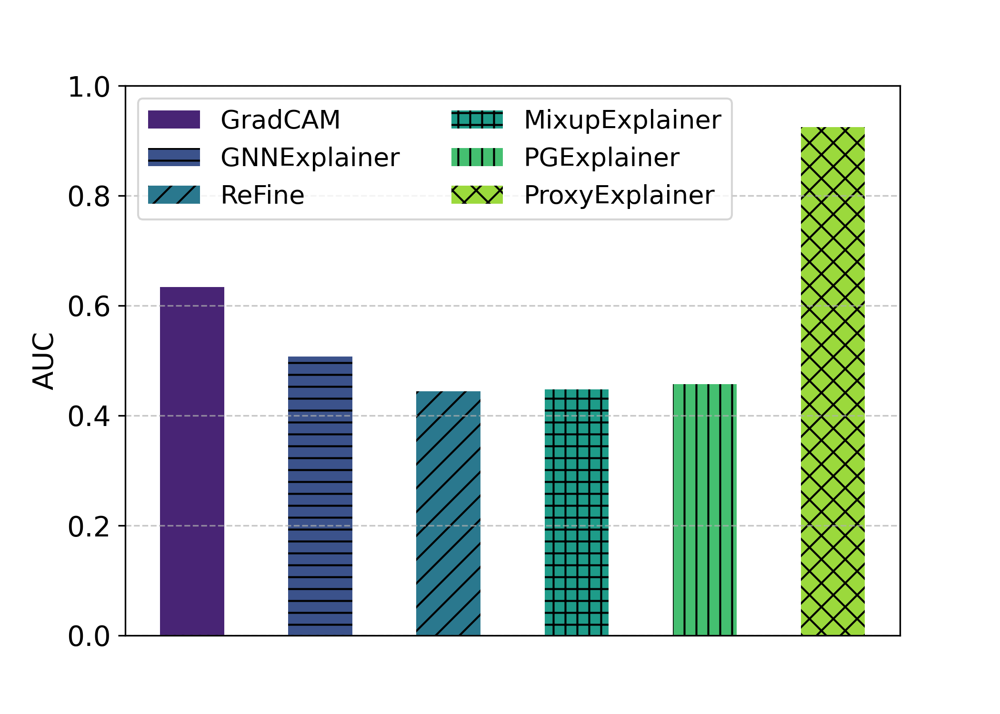
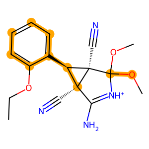

[oddsidemargin has been altered.]{.ptmr7t-}\
[The page layout violates the ICML style.]{.ptmbi7t-x-x-120} [Please do
not change the page layout, or include packages]{.ptmr7t-} [like
geometry, savetrees, or fullpage, which change it for]{.ptmr7t-}
[you.]{.ptmr7t-} [We're not able to reliably undo arbitrary changes to
the style.]{.ptmr7t-} [Please remove the offending package(s), or
layout-changing]{.ptmr7t-} [commands and try again.]{.ptmr7t-}

\_\_\_\_\_\_\_\_\_\_\_\_\_\_\_\_\_\_\_\_\_\_\_\_\_\_\_\_\_\_\_\_\_\_\_\_\_\_\_\_\_\_\_\_\_\_\_\_\_\_\_\_\_\_\_\_\_\_\_\_\_\_\_\_\_\_\_\_\_\_\_\_\_\_\_\_\_\_\_\_\_\_\_\_\_\_\_\_\_\_\_\_\_

[Generating In-Distribution Proxy Graphs for Explaining Graph
Neural]{.ptmb7t-x-x-144}
[Networks]{.ptmb7t-x-x-144}\_\_\_\_\_\_\_\_\_\_\_\_\_\_\_\_\_\_\_\_\_\_\_\_\_\_\_\_\_\_\_\_\_\_\_\_\_\_\_\_\_\_\_\_\_\_\_\_\_\_\_\_\_\_\_\_\_\_\_\_\_\_\_\_\_\_\_\_\_\_\_\_\_\_\_\_\_\_\_\_\_\_\_\_\_\_\_\_\_\_\_\_\_\_\_\_\_\_\_\_\_\_\_\_\_\_\_\_\_\_\_\_\_\_\_\_\_\_\_

::: center
[Zhuomin Chen]{.ptmb7t-} ^[1]{.ptmr7t-x-x-90}^ [Jiaxing Zhang]{.ptmb7t-}
^[2]{.ptmr7t-x-x-90}^ [Jingchao Ni]{.ptmb7t-} ^[3]{.ptmr7t-x-x-90}^
[Xiaoting Li]{.ptmb7t-} ^[4]{.ptmr7t-x-x-90}^ [Yuchen Bian]{.ptmb7t-}
^[5]{.ptmr7t-x-x-90}^ [Md Mezbahul Islam]{.ptmb7t-}
^[1]{.ptmr7t-x-x-90}^ [Ananda Mohan Mondal]{.ptmb7t-}
^[1]{.ptmr7t-x-x-90}^ [Hua Wei]{.ptmb7t-} ^[6]{.ptmr7t-x-x-90}^
[Dongsheng Luo]{.ptmb7t-} ^[1]{.ptmr7t-x-x-90}^
:::

[]{#x1-2f0}[[]{#x1-3x}
[]{#fn0x0}]{.footnote-mark}^[1]{.ptmr7t-x-x-90}^[Knight Foundation
School of Computing and Information]{.ptmr7t-x-x-90} [Sciences, Florida
International University, Miami, USA
]{.ptmr7t-x-x-90}^[2]{.ptmr7t-x-x-90}^[New]{.ptmr7t-x-x-90} [Jersey
Institute of Technology, Newark, USA
]{.ptmr7t-x-x-90}^[3]{.ptmr7t-x-x-90}^[Department of]{.ptmr7t-x-x-90}
[Computer Science, University of Houston, Houston, USA
]{.ptmr7t-x-x-90}^[4]{.ptmr7t-x-x-90}^[Visa]{.ptmr7t-x-x-90} [Research,
USA ]{.ptmr7t-x-x-90}^[5]{.ptmr7t-x-x-90}^[Amazon Search A9, USA
]{.ptmr7t-x-x-90}^[6]{.ptmr7t-x-x-90}^[School of
Computing]{.ptmr7t-x-x-90} [and Augmented Intelligence, Arizona State
University, Tempe,]{.ptmr7t-x-x-90} [USA. Correspondence to: Zhuomin
Chen
]{.ptmr7t-x-x-90}[\<]{.cmmi-9}[zchen051@fiu.edu]{.ptmr7t-x-x-90}[\>]{.cmmi-9}[,]{.ptmr7t-x-x-90}
[Dongsheng Luo
]{.ptmr7t-x-x-90}[\<]{.cmmi-9}[dluo@fiu.edu]{.ptmr7t-x-x-90}[\>]{.cmmi-9}[.]{.ptmr7t-x-x-90}

[ ]{.ptmr7t-x-x-90}\
[Proceedings of the]{.ptmri7t-x-x-90} [41]{.cmti-9}[st]{.cmmi-6}
[International Conference on Machine]{.ptmri7t-x-x-90}
[Learning]{.ptmri7t-x-x-90}[, Vienna, Austria. PMLR 235, 2024. Copyright
2024 by the]{.ptmr7t-x-x-90} [author(s).]{.ptmr7t-x-x-90}

::: abstract
::: centerline
[Abstract]{.ptmb7t-x-x-120}
:::

> Graph Neural Networks (GNNs) have become a building block in graph
> data processing, with wide applications in critical domains. The
> growing needs to deploy GNNs in high-stakes applications necessitate
> explainability for users in the decision-making processes. A popular
> paradigm for the explainability of GNNs is to identify explainable
> subgraphs by comparing their labels with the ones of original graphs.
> This task is challenging due to the substantial distributional shift
> from the original graphs in the training set to the set of explainable
> subgraphs, which prevents accurate prediction of labels with the
> subgraphs. To address it, in this paper, we propose a novel method
> that generates proxy graphs for explainable subgraphs that are in the
> distribution of training data. We introduce a parametric method that
> employs graph generators to produce proxy graphs. A new training
> objective based on information theory is designed to ensure that proxy
> graphs not only adhere to the distribution of training data but also
> preserve explanatory factors. Such generated proxy graphs can be
> reliably used to approximate the predictions of the labels of
> explainable subgraphs. Empirical evaluations across various datasets
> demonstrate our method achieves more accurate explanations for GNNs.
:::

[]{#x1-4r1}
[1.]{.ptmb7t-x-x-120}[ ]{.ptmb7t-x-x-120}[Introduction]{.ptmb7t-x-x-120}
[]{#Q1-1-1} Graph Neural Networks (GNNs) have emerged as a pivotal
technology for handling graph-structured data, demonstrating remarkable
performance in various applications including node classification and
link prediction ([????]{.ptmb7t-}). Their growing use in critical
sectors such as healthcare and fraud detection has escalated the need
for explainability in their decision-making processes ([???]{.ptmb7t-}).
To meet this demand, a variety of explanation methods have been recently
developed to interpret the behavior of GNN models. These methods
primarily concentrate on identifying a subgraph that significantly
impacts the model's prediction for a particular
instance ([??]{.ptmb7t-}). A prominent approach to explain GNNs involves
the Graph Information Bottleneck (GIB) principle ([?]{.ptmb7t-}). This
principle focuses on extracting a compact yet informative subgraph from
the input graph, ensuring that this subgraph retains sufficient
information for the model to maintain its original prediction. A key
aspect of the GIB approach is evaluating the predictive capability of
such a subgraph. Typically, this is accomplished by feeding the subgraph
into the GNN model and comparing its prediction against that of the
complete input graph.

------------------------------------------------------------------------

::: figure
::: subfigure
{width="128" height="128"} []{#x1-5r1}

::: caption
[[(a) ]{.ptmr7t-x-x-90}]{.id}[[Explanation process]{.ptmr7t-x-x-90}
]{.content}
:::
:::

  

::: subfigure
{width="87" height="87"} []{#x1-6r2}

::: caption
[[(b) ]{.ptmr7t-x-x-90}]{.id}[[OOD problem]{.ptmr7t-x-x-90} ]{.content}
:::
:::

[]{#x1-7r1}

::: caption
[Figure 1: ]{.id}[Examples of the explanation process and
out-of-distribution problem. (a) is the explanation process for a graph
learning model. The original graph [G ]{.cmmi-10}undergoes an
explanation process, resulting in an explanation graph [G]{.cmmi-10}[′
]{.cmsy-10}that highlights the most significant features and
relationships; (b) shows the explanation graph [G]{.cmmi-10}[′
]{.cmsy-10}is out of distribution where the GNN is trained. ]{.content}
:::
:::

------------------------------------------------------------------------

Although it is intuitively correct, the underlying assumption of the
aforementioned approach -- GNN model can make accurate predictions on
explanation subgraphs -- may not always hold. As shown in
Figure [1](#x1-7r1), explanation subgraphs can significantly deviate
from the distribution of original graphs, leading to an
Out-Of-Distribution (OOD) issue ([????]{.ptmb7t-}). For instance, in the
MUTAG dataset ([?]{.ptmb7t-}), each graph represents a molecule, with
nodes symbolizing atoms and edges indicating chemical bonds. The
molecular graphs in this dataset usually contain hundreds of edges. In
contrast, the [NO]{.cmmi-10}~[2]{.cmr-7}~ functional group, identified
as a key subgraph influencing positive mutagenicity in a molecule,
comprises merely 2 edges. This stark contrast in structural properties
leads to a significant difference in the distributions of explanation
subgraphs and original graphs. Since the model was trained with original
graphs, the reliability of predictions on subgraphs is undermined due to
the distribution shifting problem. Several pioneering studies have
attempted to address this distributional challenge ([???]{.ptmb7t-}).
For example, CGE regards the GNN model as a transparent, fully
accessible system. It considers the GNN model as a teacher network and
employs an additional "student" network to predict the labels of
explanation subgraphs ([?]{.ptmb7t-}). As another example,
MixupExplainer ([?]{.ptmb7t-}) generates a mixed graph for the
explanation by blending it with a non-explanatory subgraph from a
different input graph. This method posits that the mixup graph aligns
with the distribution of the original input graphs. However, this claim
is predicated on a rather simplistic assumption that the explanation and
non-explanatory subgraphs are independently drawn. However, in
real-world applications, these methods often face practical limitations.
The dependence on a "white box" model in CGE and the oversimplified
assumptions in MixupExplainer are not universally applicable. Instead,
GNN models are usually given as "black boxes", and the graphs in
real-life applications do not conform to strict independence
constraints, highlighting the need for more versatile and realistic
approaches to the OOD problem. In response to these challenges, in this
work, we introduce an innovative concept of proxy graphs to the realm of
explainable GNNs. These proxy graphs are designed to be both
explanation-preserving and distributionally aligned with the training
data. By this means, the predictive capabilities of explanation
subgraphs can be reliably inferred from the corresponding proxy graphs.
We begin with a thorough investigation into the feasible conditions
necessary for generating such in-distributed proxy graphs. Leveraging
our findings, we further propose a novel architecture that incorporates
variational graph auto-encoders to produce proxy graphs. Specifically,
we utilize a graph auto-encoder to reconstruct the explainable subgraph
and another variational auto-encoder to generate a non-explanatory
subgraph. A proxy graph is then obtained by combining two output
subgraphs of auto-encoders. We delineate our main contributions as
follows:

-   We systematically analyze and address the challenge of the OOD issue
    in explainable GNNs, which is pivotal for enhancing the reliability
    and interpretability of GNNs in real-world applications.

-   We introduce an innovative parametric method that incorporates graph
    auto-encoders to produce in-distributed proxy graphs that are both
    situated in the original data distribution and preserve essential
    explanation information. This facilitates more precise and
    interpretable explanations in GNN applications.

-   Through comprehensive experiments on various real-world datasets, we
    substantiate the effectiveness of our proposed approach, showcasing
    its practical utility and superiority in producing explanations.

[]{#x1-8r2}
[2.]{.ptmb7t-x-x-120}[ ]{.ptmb7t-x-x-120}[Notations]{.ptmb7t-x-x-120}
[and]{.ptmb7t-x-x-120} [Preliminary]{.ptmb7t-x-x-120} []{#Q1-1-3}
[]{#x1-9r1} [2.1.]{.ptmb7t-}[ ]{.ptmb7t-}[Notations]{.ptmb7t-}
[and]{.ptmb7t-} [Problem]{.ptmb7t-} [Formulation]{.ptmb7t-} []{#Q1-1-4}
We denote a graph [G ]{.cmmi-10}from an graph set
[{.10x-x-47} ]{.cmsy-10}by a triplet
[(]{.cmr-10}[{.10x-x-56}]{.cmsy-10}[,]{.cmmi-10}[{.10x-x-45}]{.cmsy-10}[;]{.cmr-10}[X]{.cmmib-10}[)]{.cmr-10},
where [{.10x-x-56} ]{.cmsy-10}[=
]{.cmr-10}[{]{.cmsy-10}[v]{.cmmi-10}~[1]{.cmr-7}~[,v]{.cmmi-10}~[2]{.cmr-7}~[,\...,v]{.cmmi-10}~[n]{.cmmi-7}~[}
]{.cmsy-10}is the node set and [{.10x-x-45}
⊆{.10x-x-56}×{.10x-x-56}
]{.cmsy-10}is the edge set. [X
]{.cmmib-10}[∈]{.cmsy-10}[ℝ]{.msbm-10}^[n]{.cmmi-7}[×]{.cmsy-7}[d]{.cmmi-7}^
is the node feature matrix, where [d ]{.cmmi-10}is the feature dimension
and the [i]{.cmmi-10}-th row is the feature vector associated with node
[v]{.cmmi-10}~[i]{.cmmi-7}~. The adjacency matrix of [G ]{.cmmi-10}is
denoted by [A
]{.cmmib-10}[∈{]{.cmsy-10}[0]{.cmr-10}[,]{.cmmi-10}[1]{.cmr-10}[}]{.cmsy-10}^[n]{.cmmi-7}[×]{.cmsy-7}[n]{.cmmi-7}^,
which is determined by the edge set [{.10x-x-45}
]{.cmsy-10}such that [A]{.cmmi-10}~[ij]{.cmmi-7}~ [= 1 ]{.cmr-10}if
[(]{.cmr-10}[v]{.cmmi-10}~[i]{.cmmi-7}~[,v]{.cmmi-10}~[j]{.cmmi-7}~[)
]{.cmr-10}[∈{.10x-x-45}]{.cmsy-10},
[A]{.cmmi-10}~[ij]{.cmmi-7}~ [= 0]{.cmr-10}, otherwise. In this paper,
we focus on the graph classification task, and node classification can
be converted to computation graph classification
problem ([??]{.ptmb7t-}). Specifically, for graph classification task,
each graph [G ]{.cmmi-10}is associated with a label [Y
]{.cmmi-10}[∈{.10x-x-59}]{.cmsy-10}. The
to-be-explained GNN model [f]{.cmmi-10}[(]{.cmr-10}[⋅]{.cmsy-10}[)
]{.cmr-10}has been well-trained to classify [G ]{.cmmi-10}into its
class, [i.e.]{.ptmri7t-}, [f ]{.cmmi-10}[:
]{.cmr-10}[{.10x-x-47}]{.cmsy-10}{.mapsto}[{]{.cmsy-10}[1]{.cmr-10}[,]{.cmmi-10}[2]{.cmr-10}[,]{.cmmi-10}{.@cdots}[,]{.cmmi-10}[\|{.10x-x-59}\|}]{.cmsy-10}.
Following the existing works ([????]{.ptmb7t-}), the explanation methods
under consideration in this paper are model/task agnostic and treat GNN
models as black boxes --- [i.e.]{.ptmri7t-}, the so-called [post-hoc,
instance-level ]{.ptmri7t-}explanation methods. Formally, our research
problem is described as follows:

::: newtheorem
[ []{#x1-10r1} [Problem 1 ]{.ptmb7t-}(Post-hoc Instance-level GNN
Explanation)[.]{.ptmb7t-} ]{.head} [Given a to-be-explained GNN model
]{.ptmri7t-}[f]{.cmmi-10}[(]{.cmr-10}[⋅]{.cmsy-10}[) ]{.cmr-10}[and a
set of]{.ptmri7t-} [graphs
]{.ptmri7t-}[{.10x-x-47}]{.cmsy-10}[, the goal of
post-hoc instance-level explanation]{.ptmri7t-} [is to learn a
parametric function so that for an arbitrary]{.ptmri7t-} [graph
]{.ptmri7t-}[G ]{.cmmi-10}[∈{.10x-x-47}]{.cmsy-10}[,
it finds a compact subgraph ]{.ptmri7t-}[G]{.cmmi-10}^[\*]{.cmsy-7}^[⊆
]{.cmsy-10}[G]{.cmmi-10}[that can]{.ptmri7t-} ["explain" the prediction
]{.ptmri7t-}[f]{.cmmi-10}[(]{.cmr-10}[G]{.cmmi-10}[)]{.cmr-10}[. The
parametric mapping]{.ptmri7t-} [Ψ]{.cmr-10}~[ψ]{.cmmi-7}~ [:
]{.cmr-10}[{.10x-x-47}]{.cmsy-10}{.mapsto}[{.10x-x-47}]{.cmsy-10}^[\*]{.cmsy-7}^
[is called an explanation function, where]{.ptmri7t-}
[{.10x-x-47}]{.cmsy-10}^[\*]{.cmsy-7}^ [is the
alphabet of ]{.ptmri7t-}[G]{.cmmi-10}^[\*]{.cmsy-7}^[, and
]{.ptmri7t-}[ψ ]{.cmmi-10}[is the parameter of the]{.ptmri7t-}
[explanation function.]{.ptmri7t-}
:::

[]{#x1-11r2} [2.2.]{.ptmb7t-}[ ]{.ptmb7t-}[Graph]{.ptmb7t-}
[Information]{.ptmb7t-} [Bottleneck]{.ptmb7t-} [as]{.ptmb7t-}
[the]{.ptmb7t-} [Objective]{.ptmb7t-} [Function]{.ptmb7t-} []{#Q1-1-5}
The Information Bottleneck (IB) principle, foundational in learning
dense representations, suggests that optimal representations should
balance minimal and sufficient information for
predictions ([?]{.ptmb7t-}). This concept has been adapted for GNNs
through the Graph Information Bottleneck (GIB) approach, consolidating
various post-hoc GNN explanation methods like
GNNExplainer ([?]{.ptmb7t-}) and PGExplainer ([?]{.ptmb7t-}). The GIB
framework aims to find a subgraph [G]{.cmmi-10}^[\*]{.cmsy-7}^ to
explain a GNN model's prediction on a graph [G
]{.cmmi-10}as ([?]{.ptmb7t-}):

+-----------------------------------+-----------------------------------+
| ::: math-display                  | \(1\)                             |
| {.math-display}[]{#x1-12r1} |                                   |
| :::                               |                                   |
+-----------------------------------+-----------------------------------+

where [G]{.cmmi-10}[′ ]{.cmsy-10}is a candidate explanatory subgraph, [Y
]{.cmmi-10}is the label, and [α ]{.cmmi-10}is a balance parameter. The
first term is the mutual information between the original graph [G
]{.cmmi-10}and the explanatory subgraph [G]{.cmmi-10}[′ ]{.cmsy-10}and
the second term is negative mutual information of [Y ]{.cmmi-10}and the
explanatory subgraph [G]{.cmmi-10}[′]{.cmsy-10}. At a high level, the
first term encourages detecting a small and dense subgraph for
explanation, and the second term requires that the explanatory subgraph
is label preserving. Due to the intractability of mutual information
between [Y ]{.cmmi-10}and [G]{.cmmi-10}[′
]{.cmsy-10}in equation [1](#x1-12r1), some existing
works ([??]{.ptmb7t-}) derived a parameterized variational lower bound
of [I]{.cmmi-10}[(]{.cmr-10}[Y,G]{.cmmi-10}[′]{.cmsy-10}[)]{.cmr-10}:

+-----------------------------------+-----------------------------------+
| ::: math-display                  | \(2\)                             |
| ![ ′ ′ ′ I(Y,G ) ≥ EG ,Y\[logP (Y |                                   |
| \|G )\]+ H (Y),                   |                                   |
| ](output4                         |                                   |
| x.png){.math-display}[]{#x1-13r2} |                                   |
| :::                               |                                   |
+-----------------------------------+-----------------------------------+

where the first term measures how well the subgraphs predict the labels.
A higher value indicates that the subgraphs are, on average, more
predictive of the correct labels. The second term
[H]{.cmmi-10}[(]{.cmr-10}[Y ]{.cmmi-10}[) ]{.cmr-10}quantifies the
amount of inherent unpredictability or variability in the labels. By
introducing equation [2](#x1-13r2) to equation [1](#x1-12r1), a
tractable upper bound is used as the objective:

+-----------------------------------+-----------------------------------+
| ::: math-display                  | \(3\)                             |
| ![ \* ′ ′ G = argGmi′n I(G, G )-  |                                   |
| αEG ′,Y\[logP (Y \|G )\],         |                                   |
| ](output5                         |                                   |
| x.png){.math-display}[]{#x1-14r3} |                                   |
| :::                               |                                   |
+-----------------------------------+-----------------------------------+

where [H]{.cmmi-10}[(]{.cmr-10}[Y ]{.cmmi-10}[) ]{.cmr-10}is omitted due
to its independence to [G]{.cmmi-10}[′]{.cmsy-10}. [The OOD Problem in
GIB. ]{.ptmb7t-}In the existing research, the estimation of
[P]{.cmmi-10}[(]{.cmr-10}[Y
]{.cmmi-10}[\|]{.cmsy-10}[G]{.cmmi-10}[′]{.cmsy-10}[) ]{.cmr-10}is
typically achieved by applying the to-be-explained model
[f]{.cmmi-10}[(]{.cmr-10}[⋅]{.cmsy-10}[) ]{.cmr-10}to the input graph
[G]{.cmmi-10}[′]{.cmsy-10} ([??]{.ptmb7t-}). A critical assumption in
these approaches involves the GNN model's ability to accurately predict
candidate explanation subgraphs [G]{.cmmi-10}[′]{.cmsy-10}. This
assumption, however, overlooks the OOD problem, where the distribution
of explanation subgraphs significantly deviates from that of the
original training graphs ([??????]{.ptmb7t-}). Formally, let
[P]{.cmmi-10}~[{.7x-x-47}]{.cmsy-7}~ be the
distribution of the training graphs, and
[P]{.cmmi-10}~[{.7x-x-47}′]{.cmsy-7}~ be the
distribution of the explanation subgraphs. The core issue in the GIB
objective function is caused by
[P]{.cmmi-10}~[{.7x-x-47}]{.cmsy-7}~[≠]{.cmmi-10}[P]{.cmmi-10}~[{.7x-x-47}′]{.cmsy-7}~.
This distributional disparity undermines the predictive reliability of
the model [f]{.cmmi-10}[(]{.cmr-10}[⋅]{.cmsy-10}[)]{.cmr-10}, trained on
[P]{.cmmi-10}~[{.7x-x-47}]{.cmsy-7}~ when applied to
subgraphs from [P]{.cmmi-10}~[{.7x-x-47}′]{.cmsy-7}~.
As a result, the predictive power of explanations provided by
[f]{.cmmi-10}[(]{.cmr-10}[G]{.cmmi-10}[′]{.cmsy-10}[) ]{.cmr-10}is an
unreliable approximation of [P]{.cmmi-10}[(]{.cmr-10}[Y
]{.cmmi-10}[\|]{.cmsy-10}[G]{.cmmi-10}[′]{.cmsy-10}[) ]{.cmr-10}in
 equation [3](#x1-14r3). []{#x1-15r3}
[3.]{.ptmb7t-x-x-120}[ ]{.ptmb7t-x-x-120}[Graph]{.ptmb7t-x-x-120}
[Information]{.ptmb7t-x-x-120} [Bottleneck]{.ptmb7t-x-x-120}
[with]{.ptmb7t-x-x-120} [Proxy]{.ptmb7t-x-x-120}
[Graphs]{.ptmb7t-x-x-120} []{#Q1-1-6} In this section, we propose the
concept of [proxy graphs ]{.ptmri7t-}to mitigate the aforementioned OOD
issue. A proxy graph not only retains the label information present in
[G]{.cmmi-10}[′ ]{.cmsy-10}but also conforms to the distribution of the
original graph dataset. Specifically, we assume that proxy graphs
{.tilde} are drawn from the distribution
[P]{.cmmi-10}~[{.7x-x-47}]{.cmsy-7}~ and reformulate
the estimation of [P]{.cmmi-10}[(]{.cmr-10}[Y
]{.cmmi-10}[\|]{.cmsy-10}[G]{.cmmi-10}[′]{.cmsy-10}[)]{.cmr-10} by
marginalizing over the distribution of proxy graphs as follows:

+-----------------------------------+-----------------------------------+
| ::: math-display                  | \(4\)                             |
| ![P (Y \|G ′) = E˜G\~P \[P(Y      |                                   |
| \|G˜)⋅P(G˜\|G ′)\]. G             |                                   |
| ](output7                         |                                   |
| x.png){.math-display}[]{#x1-16r4} |                                   |
| :::                               |                                   |
+-----------------------------------+-----------------------------------+

In equation [4](#x1-16r4), we address the OOD challenge by predicting
[Y]{.cmmi-10} using a proxy graph {.tilde} instead of
directly using [G]{.cmmi-10}[′]{.cmsy-10}. This approach is particularly
effective when the conditional probability [P]{.cmmi-10}[(]{.cmr-10}[Y
]{.cmmi-10}[\|⋅]{.cmsy-10}[) ]{.cmr-10}is approximated by the model
[f]{.cmmi-10}[(]{.cmr-10}[⋅]{.cmsy-10}[)]{.cmr-10}. To facilitate the
maximization of the likelihood as outlined in equation [4](#x1-16r4), we
further approximate
[P]{.cmmi-10}[(]{.cmr-10}{.tilde}[\|]{.cmsy-10}[G]{.cmmi-10}[′]{.cmsy-10}[)
]{.cmr-10}with a parameterized function, denoted as
[Q]{.cmmi-10}~[ϕ]{.cmmib-7}~[(]{.cmr-10}{.tilde}[\|]{.cmsy-10}[G]{.cmmi-10}[′]{.cmsy-10}[)]{.cmr-10}.
The formal representation is thus given by

+-----------------------------------+-----------------------------------+
| ::: math-display                  | \(5\)                             |
| ![P(Y \|G ′) = E ˜ \[P(Y\|˜G) ⋅Q  |                                   |
| ϕ(˜G\|G′)\], G\~PG                |                                   |
| ](output11                        |                                   |
| x.png){.math-display}[]{#x1-17r5} |                                   |
| :::                               |                                   |
+-----------------------------------+-----------------------------------+

where [ϕ ]{.cmmib-10}denotes model parameters. Given the combinatorial
complexity inherent in graph structures, it is computationally
infeasible to enumerate all potential proxy graphs
{.tilde} from the unknown distribution
[P]{.cmmi-10}~[{.7x-x-47}]{.cmsy-7}~, which is
necessary for calculating equation [5](#x1-17r5). To overcome this
challenge, we propose to approximate
[P]{.cmmi-10}~[{.7x-x-47}]{.cmsy-7}~ with the
parameterized function
[Q]{.cmmi-10}~[ϕ]{.cmmib-7}~[(]{.cmr-10}{.tilde}[\|]{.cmsy-10}[G]{.cmmi-10}[′]{.cmsy-10}[)]{.cmr-10},
and estimate equation [5](#x1-17r5) with a Monte Carlo estimator that
samples proxy graphs from
[Q]{.cmmi-10}~[ϕ]{.cmmib-7}~[(]{.cmr-10}{.tilde}[\|]{.cmsy-10}[G]{.cmmi-10}[′]{.cmsy-10}[)]{.cmr-10}.
That is

+-----------------------------------+-----------------------------------+
| ::: math-display                  | \(6\)                             |
| ![P (Y \|G ′) = E˜G\~Q            |                                   |
| (G˜\|G′)\[P(Y \|˜G )\], ϕ         |                                   |
| ](output15                        |                                   |
| x.png){.math-display}[]{#x1-18r6} |                                   |
| :::                               |                                   |
+-----------------------------------+-----------------------------------+

with constraints

+-----------------------------------+-----------------------------------+
| ::: math-display                  | \(7\)                             |
| {.math-display}[]{#x1-19r7} |                                   |
| :::                               |                                   |
+-----------------------------------+-----------------------------------+

where the first constraint ensures that {.tilde}
is sampled from a distribution that approximates
[P]{.cmmi-10}~[{.7x-x-47}]{.cmsy-7}~, effectively
addressing the OOD challenge. The second constraint guarantees that the
label information preserved in {.tilde} is similar
to that in [G]{.cmmi-10}[′]{.cmsy-10}. Therefore, combining
equation [3](#x1-14r3), equation [6](#x1-18r6) and
equation [7](#x1-19r7), our proxy graph-induced objective function
becomes:

+-----------------------------------+-----------------------------------+
| ::: math-display                  | \(8\)                             |
| ![ argmi′n I(G,G ′)- αEG          |                                   |
| ′,Y\[logE ˜G\~Qϕ(˜G\|G′)\[P       |                                   |
| (Y\|˜G)\]\] G ′ ′ s.t. Qϕ (G˜\|G  |                                   |
| ) ≈ PG, H (Y\|˜G) ≈ H (Y\|G ).    |                                   |
| ](output19                        |                                   |
| x.png){.math-display}[]{#x1-20r8} |                                   |
| :::                               |                                   |
+-----------------------------------+-----------------------------------+

[Bi-level optimization. ]{.ptmb7t-}In equation [8](#x1-20r8), we
formulate a joint optimization loss function that aims to identify the
optimal explanation alongside its corresponding proxy graphs. Building
upon this, we refine the framework by replacing the first constraint
with a distributional distance measure, specifically the
Kullback-Leibler (KL) divergence, between
[Q]{.cmmi-10}~[ϕ]{.cmmib-7}~[(]{.cmr-10}{.tilde}[\|]{.cmsy-10}[G]{.cmmi-10}[′]{.cmsy-10}[)
]{.cmr-10}and [P]{.cmmi-10}~[{.7x-x-47}]{.cmsy-7}~.
This leads to the development of a bi-level optimization model.
Formally, the model is expressed as follows:

+-----------------------------------+-----------------------------------+
| ::: math-display                  | \(9\)                             |
| ![argmi′n I(G, G′)- αEG           |                                   |
| ′,Y\[logEG˜\~Qϕ\*(G˜\|G′)\[P(Y    |                                   |
| \|G˜)\]\] G \* ′ whereϕ =         |                                   |
| argϕminK L(Qϕ(˜G\|G ),PG), ′ s.   |                                   |
| t. H (Y\|˜G) ≈ H (Y\|G ).         |                                   |
| ](output21                        |                                   |
| x.png){.math-display}[]{#x1-21r9} |                                   |
| :::                               |                                   |
+-----------------------------------+-----------------------------------+

[]{#x1-22r1} [3.1.]{.ptmb7t-}[ ]{.ptmb7t-}[Derivation]{.ptmb7t-}
[of]{.ptmb7t-} [Outer]{.ptmb7t-} [Optimization]{.ptmb7t-} []{#Q1-1-7}
For the outer optimization objective, we elaborate on instantiating the
first term
[I]{.cmmi-10}[(]{.cmr-10}[G,G]{.cmmi-10}[′]{.cmsy-10}[)]{.cmr-10}. Akin
to the original graph, we denote the explanation subgraph
[G]{.cmmi-10}[′ ]{.cmsy-10}by
[(]{.cmr-10}[{.10x-x-56}]{.cmsy-10}[,]{.cmmi-10}[{.10x-x-45}′]{.cmsy-10}[,]{.cmmi-10}[X]{.cmmib-10}[)]{.cmr-10},
whose adjacency matrix is [A]{.cmmib-10}[′]{.cmsy-10}. We
follow ([?]{.ptmb7t-}) to include a variational approximation
distribution [R]{.cmmi-10}[(]{.cmr-10}[G]{.cmmi-10}[′]{.cmsy-10}[)
]{.cmr-10}for the distribution
[P]{.cmmi-10}[(]{.cmr-10}[G]{.cmmi-10}[′]{.cmsy-10}[)]{.cmr-10}. Then,
we obtain its upper bound as follows:

+-----------------------------------+-----------------------------------+
| ::: math-display                  | \(10\)                            |
| ![I(G,G ′) ≤ EG \[K               |                                   |
| L(P(G′\|G)\|\|R(G ′))\].          |                                   |
| ](output22x                       |                                   |
| .png){.math-display}[]{#x1-23r10} |                                   |
| :::                               |                                   |
+-----------------------------------+-----------------------------------+

We follow the Erdős--Rényi model ([?]{.ptmb7t-}) and assume that each
edge in [G]{.cmmi-10}[′ ]{.cmsy-10}has a probability of being present or
absent, independently of the other edges. Specifically, we assume that
the existence of an edge [(]{.cmr-10}[u,v]{.cmmi-10}[) ]{.cmr-10}in
[G]{.cmmi-10}[′ ]{.cmsy-10}is determined by a Bernoulli variable
[A]{.cmmi-10}~[u,v]{.cmmi-7}~[′\~]{.cmsy-10}
Bern[(]{.cmr-10}[π]{.cmmi-10}[′]{.cmsy-10}~[uv]{.cmmi-7}~[)]{.cmr-10}.
Thus,
[P]{.cmmi-10}[(]{.cmr-10}[G]{.cmmi-10}[′\|]{.cmsy-10}[G]{.cmmi-10}[)
]{.cmr-10}can be decomposed as
[P]{.cmmi-10}[(]{.cmr-10}[G]{.cmmi-10}[′\|]{.cmsy-10}[G]{.cmmi-10}[)
=]{.cmr-10} [∏]{.cmex-10}
~[(]{.cmr-7}[u,v]{.cmmi-7}[)]{.cmr-7}[∈{.7x-x-45}]{.cmsy-7}~[P]{.cmmi-10}[(]{.cmr-10}[A]{.cmmi-10}~[uv]{.cmmi-7}~[′\|]{.cmsy-10}[π]{.cmmi-10}[′]{.cmsy-10}~[uv]{.cmmi-7}~[)]{.cmr-10}.
The bound is always true for any prior distribution
[R]{.cmmi-10}[(]{.cmr-10}[G]{.cmmi-10}[′]{.cmsy-10}[)]{.cmr-10}. We
follow an existing work and assume that in the prior distribution, the
existence of an edge [(]{.cmr-10}[u,v]{.cmmi-10}[) ]{.cmr-10}in
[G]{.cmmi-10}[′ ]{.cmsy-10}is determined by another Bernoulli variable
[A]{.cmmi-10}~[u,v]{.cmmi-7}~^[′′]{.cmsy-7}^ [\~]{.cmsy-10}
Bern[(]{.cmr-10}[r]{.cmmi-10}[)]{.cmr-10}, where [r ]{.cmmi-10}[∈
]{.cmsy-10}[\[0]{.cmr-10}[,]{.cmmi-10}[1\] ]{.cmr-10}is a
hyper-parameter ([?]{.ptmb7t-}), independently to the graph
[G]{.cmmi-10}. We have
[R]{.cmmi-10}[(]{.cmr-10}[G]{.cmmi-10}[′]{.cmsy-10}[) =
]{.cmr-10}[P]{.cmmi-10}[(]{.cmr-10}[\|{.10x-x-45}\|]{.cmsy-10}[)]{.cmr-10}[∏]{.cmex-10}
~[(]{.cmr-7}[u,v]{.cmmi-7}[)]{.cmr-7}[∈{.7x-x-45}]{.cmsy-7}~[P]{.cmmi-10}[(]{.cmr-10}[A]{.cmmi-10}~[uv]{.cmmi-7}~^[′′]{.cmsy-7}^[)]{.cmr-10}.
Thus, the KL divergence between
[P]{.cmmi-10}[(]{.cmr-10}[G]{.cmmi-10}[′\|]{.cmsy-10}[G]{.cmmi-10}[)
]{.cmr-10}and the above marginal distribution
[R]{.cmmi-10}[(]{.cmr-10}[G]{.cmmi-10}[′]{.cmsy-10}[) ]{.cmr-10}becomes:

+-----------------------------------+-----------------------------------+
| ::: math-display                  | \(11\)                            |
| {.math-display}[]{#x1-24r11} |                                   |
| :::                               |                                   |
+-----------------------------------+-----------------------------------+

By replacing [I]{.cmmi-10}[(]{.cmr-10}[G,G]{.cmmi-10}[′]{.cmsy-10}[)
]{.cmr-10}with the above tractable upper bound, we obtain the loss
function, denoted by [{.10x-x-4c}]{.cmsy-10}~exp~,
for training the explainer [Ψ(]{.cmr-10}[⋅]{.cmsy-10}[)]{.cmr-10}.
[]{#x1-25r2} [3.2.]{.ptmb7t-}[ ]{.ptmb7t-}[Derivation]{.ptmb7t-}
[of]{.ptmb7t-} [Inner]{.ptmb7t-} [Optimization]{.ptmb7t-} []{#Q1-1-8}
For the inner optimization objective, we implement the first constraint
by minimizing the distribution distance between
[Q]{.cmmi-10}~[ϕ]{.cmmib-7}~[(]{.cmr-10}{.tilde}[\|]{.cmsy-10}[G]{.cmmi-10}[′]{.cmsy-10}[)
]{.cmr-10}and [P]{.cmmi-10}~[{.7x-x-47}]{.cmsy-7}~.
Under the Erdős--Rényi assumption, the distribution loss is equivalent
to the cross-entropy loss between {.tilde} given
[G]{.cmmi-10}[′ ]{.cmsy-10}and [G ]{.cmmi-10}over the full adjacency
matrix ([?]{.ptmb7t-}). Considering that [G ]{.cmmi-10}is usually sparse
rather than a fully connected graph, in practice, we adopt a weighted
version to emphasize more connected node pairs ([?]{.ptmb7t-}).
Formally, we have the following distribution loss.

+-----------------------------------+-----------------------------------+
| ::: math-display                  | \(12\)                            |
| {.math-display}[]{#x1-26r12} |                                   |
| :::                               |                                   |
+-----------------------------------+-----------------------------------+

where [[{.10x-x-45}]{.cmsy-10}]{.bar-css} is the set
of node pairs that are unconnected in [G]{.cmmi-10},
{.tilde} ~[uv]{.cmmi-7}~ is the probability of node
pair [(]{.cmr-10}[u,v]{.cmmi-10}[) ]{.cmr-10}in {.tilde}, and [β ]{.cmmi-10}is a hyper-parameter to for
the trade-off between connected and unconnected node pairs. The second
constraint requires the mutual information of [Y]{.cmmi-10} and
{.tilde} is the same as that of [Y ]{.cmmi-10}and
[G]{.cmmi-10}[′]{.cmsy-10}. Due to the OOD problem, it is non-trivial to
directly compute [P]{.cmmi-10}[(]{.cmr-10}[Y
]{.cmmi-10}[\|]{.cmsy-10}[G]{.cmmi-10}[′]{.cmsy-10}[) ]{.cmr-10}or
[H]{.cmmi-10}[(]{.cmr-10}[Y
]{.cmmi-10}[\|]{.cmsy-10}[G]{.cmmi-10}[′]{.cmsy-10}[)]{.cmr-10}.
Instead, we implement this constraint with a novel graph generator that
{.tilde} is obtained by combining [G]{.cmmi-10}[′
]{.cmsy-10}and a non-explanatory subgraph ([?]{.ptmb7t-}). In practice,
we implement the non-explanatory part by perturbing the residual
subgraph [G ]{.cmmi-10}[- ]{.cmsy-10}[G]{.cmmi-10}[′]{.cmsy-10}. The
intuition is that if an explanation comprises label information, it is
unlikely to change the prediction by manipulating the remaining
non-explanatory part, which is widely adopted in the
literature ([??]{.ptmb7t-}).

------------------------------------------------------------------------

::: figure
{width="243" height="243"} []{#x1-27r2}\

::: caption
[ Figure 2: ]{.id}[ProxyExplainer consists of two components: an
Explainer and a Proxy Graph Generator. The Explainer takes a graph [G
]{.cmmi-10}as input and produces an explainable subgraph
[G]{.cmmi-10}[′]{.cmsy-10}, The proxy generator creates in-distribution
proxy graphs that preserve the label information in
[G]{.cmmi-10}[′]{.cmsy-10}. The proxy generator consists of a graph
auto-encoder (GAE) and a variational graph auto-encoder (VGAE).
]{.content}
:::
:::

------------------------------------------------------------------------

[]{#x1-28r4}
[4.]{.ptmb7t-x-x-120}[ ]{.ptmb7t-x-x-120}[The]{.ptmb7t-x-x-120}
[ProxyExplainer]{.ptmb7t-x-x-120} []{#Q1-1-10} Based on our novel GIB
with proxy graphs, in this section, we introduce a straightforward yet
theoretically robust instantiation, named ProxyExplainer. As shown in
Figure [2](#x1-27r2), the architecture of our model comprises two key
modules: the explainer and the proxy graph generator. The explainer
takes the original graph [G ]{.cmmi-10}as its input and outputs a
subgraph [G]{.cmmi-10}[′ ]{.cmsy-10}as an explanation, which is
optimized through the outer objective in equation [9](#x1-21r9). The
proxy graph generator generates an in-distributed proxy graph, which is
optimized with the inner objective. []{#x1-29r1}
[4.1.]{.ptmb7t-}[ ]{.ptmb7t-}[The]{.ptmb7t-} [Explainer]{.ptmb7t-}
[]{#Q1-1-11} For the sake of optimization, we follow the existing works
to relax the element in [A ]{.cmmib-10}from binary values to continuous
values in the range
[\[0]{.cmr-10}[,]{.cmmi-10}[1\]]{.cmr-10} ([??]{.ptmb7t-}). We adopt a
generative explainer due to its effectiveness and
efficiency ([?]{.ptmb7t-}). Specifically, we decompose the
to-be-explained model [f]{.cmmi-10}[(]{.cmr-10}[⋅]{.cmsy-10}[)
]{.cmr-10}into two functions that
[f]{.cmmi-10}~enc~[(]{.cmr-10}[⋅]{.cmsy-10}[) ]{.cmr-10}learns node
representations and [f]{.cmmi-10}~cls~[(]{.cmr-10}[⋅]{.cmsy-10}[)
]{.cmr-10}predicts graph labels based on node embeddings. Formally, we
have [Z ]{.cmmib-10}[=
]{.cmr-10}[f]{.cmmi-10}~enc~[(]{.cmr-10}[X]{.cmmib-10}[,]{.cmmi-10}[A]{.cmmib-10}[)
]{.cmr-10}and [Ŷ]{.cmmi-10} [=
]{.cmr-10}[f]{.cmmi-10}~cls~[(]{.cmr-10}[Z]{.cmmib-10}[)]{.cmr-10},
where [Z ]{.cmmib-10}is the node representation matrix and [Ŷ]{.cmmi-10}
is prediction. Routinely,
[f]{.cmmi-10}~cls~[(]{.cmr-10}[⋅]{.cmsy-10}[)]{.cmr-10} consists of a
pooling layer followed by a classification layer and
[f]{.cmmi-10}~enc~[(]{.cmr-10}[⋅]{.cmsy-10}[) ]{.cmr-10}consists of the
other layers. Following the independence assumption in
Section [3.1](#x1-22r1), we approximate Bernoulli distributions with
binary concrete distributions ([??]{.ptmb7t-}). Specifically, the
probability of sampling an edge [(]{.cmr-10}[u,v]{.cmmi-10}[)
]{.cmr-10}is computed by an MLP parameterized by [ψ]{.cmmi-10}, denoted
by [g]{.cmmi-10}~[ψ]{.cmmi-7}~[(]{.cmr-10}[⋅]{.cmsy-10}[)]{.cmr-10}.
Formally, we have

+-----------------------------------+-----------------------------------+
| ::: math-display                  | \(13\)                            |
| ![ωuv = gψ(\[zu;zv\]), ϵ \~       |                                   |
| Uniform(0,1), A ′ = σ((logϵ -     |                                   |
| log(1- ϵ)+ ωuv)∕τ), uv            |                                   |
| ](output31x                       |                                   |
| .png){.math-display}[]{#x1-30r13} |                                   |
| :::                               |                                   |
+-----------------------------------+-----------------------------------+

where
[\[]{.cmr-10}[z]{.cmmib-10}~[u]{.cmmi-7}~[;]{.cmr-10}[z]{.cmmib-10}~[v]{.cmmi-7}~[\]
]{.cmr-10}is the concatenation of node representations
[z]{.cmmib-10}~[u]{.cmmi-7}~ and [z]{.cmmib-10}~[v]{.cmmi-7}~, [ϵ
]{.cmmi-10}is a independent variable,
[σ]{.cmmi-10}[(]{.cmr-10}[⋅]{.cmsy-10}[) ]{.cmr-10}is the Sigmoid
function, and [τ ]{.cmmi-10}is a temperature hyper-parameter for
approximation. According to ([?]{.ptmb7t-}), the parameter
[π]{.cmmi-10}[′]{.cmsy-10}~[uv]{.cmmi-7}~ of Bernoulli distribution in
equation [11](#x1-24r11) can be obtained by
[π]{.cmmi-10}[′]{.cmsy-10}~[uv]{.cmmi-7}~ [=]{.cmr-10}
{.frac align="middle"}.
[]{#x1-31r2} [4.2.]{.ptmb7t-}[ ]{.ptmb7t-}[The]{.ptmb7t-}
[Proxy]{.ptmb7t-} [Graph]{.ptmb7t-} [Generator]{.ptmb7t-} []{#Q1-1-12}
As shown in our analysis in Section [3.2](#x1-25r2), we demonstrate the
synthesis of a proxy graph through the amalgamation of the explanation
subgraph [G]{.cmmi-10}[′ ]{.cmsy-10}and the perturbation of its
non-explanatory subgraph, represented as [G]{.cmmi-10}^[Δ]{.cmr-7}^ [=
(]{.cmr-10}[{.10x-x-56}]{.cmsy-10}[,]{.cmmi-10}[{.10x-x-45}]{.cmsy-10}^[Δ]{.cmr-7}^[,]{.cmmi-10}[X]{.cmmib-10}[)]{.cmr-10}.
We define the edge set of
[G]{.cmmi-10}^[Δ]{.cmr-7}^[,]{.cmmi-10}[{.10x-x-45}]{.cmsy-10}^[Δ]{.cmr-7}^,
as the differential set
[{.10x-x-45}-{.10x-x-45}′]{.cmsy-10}.
Correspondingly, the adjacency matrix [A]{.cmmib-10}^[Δ]{.cmr-7}^ is
derived through [A ]{.cmmib-10}[-]{.cmsy-10}[A]{.cmmib-10}[′]{.cmsy-10}.
Building upon this foundation, and as illustrated in
Figure [2](#x1-27r2), our proposed framework introduces a
dual-structured mechanism comprising two distinct graph
auto-encoders(GAE) ([?]{.ptmb7t-}). To be more specific, we first
include an encoder to learn a latent matrix [Z]{.cmmib-10}[′
]{.cmsy-10}according to [A]{.cmmib-10}[′ ]{.cmsy-10}and
[X]{.cmmib-10}[′]{.cmsy-10}, and a decoder network recovers
[A]{.cmmib-10}[′ ]{.cmsy-10}based on [Z]{.cmmib-10}[′]{.cmsy-10}.
Formally, we have:

+-----------------------------------+-----------------------------------+
| ::: math-display                  | \(14\)                            |
| {.math-display}[]{#x1-32r14} |                                   |
| :::                               |                                   |
+-----------------------------------+-----------------------------------+

where ENC~[1]{.cmr-7}~ and DEC are the encoder network and decoder
network. Our framework is flexible to the choices of these two networks.
{.tilde}[′∈]{.cmsy-10}[ℝ]{.msbm-10}^[n]{.cmmi-7}[×]{.cmsy-7}[n]{.cmmi-7}^
is the reconstructed adjacency matrix. To introduce perturbations into
the non-explanatory segment, our approach employs a Variational Graph
Auto-Encoder (VGAE), a generative model adept at creating varied yet
structurally coherent graph data. This capability is pivotal in
generating nuanced variations of the non-explanatory subgraph. The VGAE
operates by first encoding the non-explanatory subgraph
[G]{.cmmi-10}^[Δ]{.cmr-7}^ into a latent probabilistic space,
characterized by Gaussian distributions. This process is articulated as:

+-----------------------------------+-----------------------------------+
| ::: math-display                  | \(15\)                            |
| {.math-display}[]{#x1-33r15} |                                   |
| :::                               |                                   |
+-----------------------------------+-----------------------------------+

where ENC~[1]{.cmr-7}~ and ENC~[2]{.cmr-7}~ are encoder networks that
learn the mean [μ]{.cmmib-10}^[Δ]{.cmr-7}^ and variance
[σ]{.cmmib-10}^[Δ]{.cmr-7}^ of the Gaussian distributions, respectively.
Following this, the latent representations [Z]{.cmmib-10}^[Δ]{.cmr-7}^
are sampled from these distributions, ensuring that each generated
instance is a unique variation of the original. The decoder network then
reconstructs the perturbed non-explanatory subgraph from these sampled
latent representations:

+-----------------------------------+-----------------------------------+
| ::: math-display                  | \(16\)                            |
| {.math-display}[]{#x1-34r16} |                                   |
| :::                               |                                   |
+-----------------------------------+-----------------------------------+

where {.tilde}^[Δ]{.cmr-7}^
[∈]{.cmsy-10}[ℝ]{.msbm-10}^[n]{.cmmi-7}[×]{.cmsy-7}[n]{.cmmi-7}^
represents the adjacency matrix of the perturbed non-explanatory
subgraph. This novel use of VGAE facilitates the generation of diverse
yet representative perturbations, crucial for enhancing the
interpretability of explainers in our proxy graph framework. The
adjacency matrix of a proxy graph is then obtained by

+-----------------------------------+-----------------------------------+
| ::: math-display                  | \(17\)                            |
| {.math-display}[]{#x1-35r17} |                                   |
| :::                               |                                   |
+-----------------------------------+-----------------------------------+

[Loss function. ]{.ptmb7t-}To train the proxy graph generator, we
introduce a standard Gaussian distribution as the prior for the latent
space representations in the VGAE, specifically [Z
]{.cmmib-10}[\~{.10x-x-4e}]{.cmsy-10}[(0]{.cmr-10}[,]{.cmmi-10}[{.10x-x-49}]{.cmsy-10}[)]{.cmr-10},
where [{.10x-x-49} ]{.cmsy-10}represents the identity
matrix. Then, the loss function is as follows.

+-----------------------------------+-----------------------------------+
| ::: math-display                  | \(18\)                            |
| {.math-display}[]{#x1-36r18} |                                   |
| :::                               |                                   |
+-----------------------------------+-----------------------------------+

where [{.10x-x-4c}]{.cmsy-10}~dist~ is equivalent to
cross-entropy between {.tilde} and
[G]{.cmmi-10} ([?]{.ptmb7t-}).
[{.10x-x-4c}]{.cmsy-10}~KL~ represents the KL
divergence between the distribution of the latent representations
[Z]{.cmmib-10}^[Δ]{.cmr-7}^ and the assumed Gaussian prior. This term is
crucial for regulating the variational aspect of the VGAE, ensuring that
the generated perturbations are meaningful and controlled. [λ
]{.cmmi-10}is a hyper-parameter. [Alternate Training. ]{.ptmb7t-}To
train the explainer and the proxy graph generator networks, we follow
existing works ([?]{.ptmb7t-}) to use an alternate training schedule
that trains the proxy graph generator network [M ]{.cmmi-10}times and
then trains the explainer network once. [M ]{.cmmi-10}is a
hyper-parameter determined by grid search. The detailed algorithm
description of our model is shown in Appendix [B](#x1-2003r2).
[]{#x1-37r5}
[5.]{.ptmb7t-x-x-120}[ ]{.ptmb7t-x-x-120}[Related]{.ptmb7t-x-x-120}
[Work]{.ptmb7t-x-x-120} []{#Q1-1-13} [GNN Explanation. ]{.ptmb7t-}The
goal of explainability in GNNs is to ensure transparency in graph-based
tasks. Recent works have been directed towards elucidating the rationale
behind GNN predictions. These explanation methods can be broadly
classified into two categories: instance-level and model-level
approaches ([?]{.ptmb7t-}). In this study, we focus on instance-level
explanations, which aim to clarify the specific reasoning behind
individual predictions made by GNNs. These methods are critical for
understanding the decision-making process on a case-by-case basis to
enhance the explainability of GNNs. For example, GNNExplainer
([?]{.ptmb7t-}) excludes certain edges and node features to observe the
changes in prediction. However, its single-instance focus limits its
applicability to provide a global understanding of the to-be-explained
model ([?]{.ptmb7t-}). PGExplainer ([??]{.ptmb7t-}) introduces a
parametric neural network to learn edge weights. Thus, once training is
complete, it can explain new graphs without retraining. ReFine
([?]{.ptmb7t-}) integrates a pre-training phase that focuses on class
comparisons and is fine-tuned to refine context-specific explanations.
GStarX ([?]{.ptmb7t-}) assigns an importance score to each node by
caculating the Hamiache and Navarro values of the structure to obtain
explanatory subgraphs. GFlowExplainer ([?]{.ptmb7t-}) uses a generator
to construct a TD-like flow matching condition to learn a policy for
generating explanations by adding nodes sequentially. [Distribution
Shifting in Explanations. ]{.ptmb7t-}The distribution shifting problem
in post-hoc explanations has been increasingly recognized in explainable
AI fields ([??]{.ptmb7t-}). For example, FIDO ([?]{.ptmb7t-}) works on
enhancing image classifier explanations, focusing on relevant contextual
details that agree with the training data's distribution. A recent study
tackles the distribution shifting problem in image explanations by
introducing a module that assesses the similarity between altered data
and the original dataset distribution ([?]{.ptmb7t-}). In the graph
domain, an ad-hoc strategy to mitigate distribution shifting is to
initially reduce the size constraint coefficient during the explanation
process ([?]{.ptmb7t-}). MixupExplainer ([?]{.ptmb7t-}) and
RegExplainer ([?]{.ptmb7t-}) propose non-parametric solutions by mixing
up the explanation subgraph with a non-explainable part from another
graph. However, these methods operates under the assumption that the
explanatory and non-explanatory subgraphs in mixed graphs are
independent, which may not hold in many real-life graphs. []{#x1-38r6}
[6.]{.ptmb7t-x-x-120}[ ]{.ptmb7t-x-x-120}[Experiments]{.ptmb7t-x-x-120}
[]{#Q1-1-14}

------------------------------------------------------------------------

::: float
[]{#x1-39r1}

::: caption
[ Table 1: ]{.id}[Explanation accuracy in terms of AUC-ROC on edges.
]{.content}
:::

::: tabular
  ---------------- --------------------------------------------------------------------- --------------------------------------------------------------------- --------------------------------------------------------------------- --------------------------------------------------------------------- --------------------------------------------------------------------- ---------------------------------------------------------------------
                   MUTAG                                                                 Benzene                                                               Alkane-Carbonyl                                                       Fluoride-Carbonyl                                                     BA-2motifs                                                            BA-3motifs
  GradCAM          0.727~[±]{.cmsy-7}[0]{.cmr-7}[.]{.cmmi-7}[000]{.cmr-7}~               0.740~[±]{.cmsy-7}[0]{.cmr-7}[.]{.cmmi-7}[000]{.cmr-7}~               0.448~[±]{.cmsy-7}[0]{.cmr-7}[.]{.cmmi-7}[000]{.cmr-7}~               0.694~[±]{.cmsy-7}[0]{.cmr-7}[.]{.cmmi-7}[000]{.cmr-7}~               0.714~[±]{.cmsy-7}[0]{.cmr-7}[.]{.cmmi-7}[000]{.cmr-7}~               0.709~[±]{.cmsy-7}[0]{.cmr-7}[.]{.cmmi-7}[000]{.cmr-7}~
  GNNExplainer     0.682~[±]{.cmsy-7}[0]{.cmr-7}[.]{.cmmi-7}[009]{.cmr-7}~               0.485~[±]{.cmsy-7}[0]{.cmr-7}[.]{.cmmi-7}[001]{.cmr-7}~               0.551~[±]{.cmsy-7}[0]{.cmr-7}[.]{.cmmi-7}[003]{.cmr-7}~               0.574~[±]{.cmsy-7}[0]{.cmr-7}[.]{.cmmi-7}[002]{.cmr-7}~               0.644~[±]{.cmsy-7}[0]{.cmr-7}[.]{.cmmi-7}[007]{.cmr-7}~               0.511~[±]{.cmsy-7}[0]{.cmr-7}[.]{.cmmi-7}[002]{.cmr-7}~
  PGExplainer      0.832~[±]{.cmsy-7}[0]{.cmr-7}[.]{.cmmi-7}[032]{.cmr-7}~               0.793~[±]{.cmsy-7}[0]{.cmr-7}[.]{.cmmi-7}[054]{.cmr-7}~               0.660~[±]{.cmsy-7}[0]{.cmr-7}[.]{.cmmi-7}[036]{.cmr-7}~               0.702~[±]{.cmsy-7}[0]{.cmr-7}[.]{.cmmi-7}[018]{.cmr-7}~               0.734~[±]{.cmsy-7}[0]{.cmr-7}[.]{.cmmi-7}[117]{.cmr-7}~               0.796~[±]{.cmsy-7}[0]{.cmr-7}[.]{.cmmi-7}[010]{.cmr-7}~
  ReFine           0.612~[±]{.cmsy-7}[0]{.cmr-7}[.]{.cmmi-7}[004]{.cmr-7}~               0.606~[±]{.cmsy-7}[0]{.cmr-7}[.]{.cmmi-7}[002]{.cmr-7}~               0.768~[±]{.cmsy-7}[0]{.cmr-7}[.]{.cmmi-7}[001]{.cmr-7}~               0.571~[±]{.cmsy-7}[0]{.cmr-7}[.]{.cmmi-7}[000]{.cmr-7}~               0.698~[±]{.cmsy-7}[0]{.cmr-7}[.]{.cmmi-7}[001]{.cmr-7}~               0.629~[±]{.cmsy-7}[0]{.cmr-7}[.]{.cmmi-7}[005]{.cmr-7}~
  MixupExplainer   0.863~[±]{.cmsy-7}[0]{.cmr-7}[.]{.cmmi-7}[103]{.cmr-7}~               0.611~[±]{.cmsy-7}[0]{.cmr-7}[.]{.cmmi-7}[032]{.cmr-7}~               0.811~[±]{.cmsy-7}[0]{.cmr-7}[.]{.cmmi-7}[006]{.cmr-7}~               0.706~[±]{.cmsy-7}[0]{.cmr-7}[.]{.cmmi-7}[013]{.cmr-7}~               0.906~[±]{.cmsy-7}[0]{.cmr-7}[.]{.cmmi-7}[059]{.cmr-7}~               0.859~[±]{.cmsy-7}[0]{.cmr-7}[.]{.cmmi-7}[019]{.cmr-7}~
  ProxyExplainer   [0.977]{.ptmb7t-}~[±]{.cmsy-7}[0]{.cmr-7}[.]{.cmmi-7}[009]{.cmr-7}~   [0.845]{.ptmb7t-}~[±]{.cmsy-7}[0]{.cmr-7}[.]{.cmmi-7}[036]{.cmr-7}~   [0.934]{.ptmb7t-}~[±]{.cmsy-7}[0]{.cmr-7}[.]{.cmmi-7}[005]{.cmr-7}~   [0.758]{.ptmb7t-}~[±]{.cmsy-7}[0]{.cmr-7}[.]{.cmmi-7}[068]{.cmr-7}~   [0.935]{.ptmb7t-}~[±]{.cmsy-7}[0]{.cmr-7}[.]{.cmmi-7}[008]{.cmr-7}~   [0.960]{.ptmb7t-}~[±]{.cmsy-7}[0]{.cmr-7}[.]{.cmmi-7}[008]{.cmr-7}~
                                                                                                                                                                                                                                                                                                                                                                                 
  ---------------- --------------------------------------------------------------------- --------------------------------------------------------------------- --------------------------------------------------------------------- --------------------------------------------------------------------- --------------------------------------------------------------------- ---------------------------------------------------------------------
:::
:::

------------------------------------------------------------------------

::: table

------------------------------------------------------------------------

::: float
[]{#x1-40r2}

::: caption
[ Table 2: ]{.id}[Explanation accuracy in terms of AP on MUTAG and
BA-2motifs. ]{.content}
:::

::: tabular
  ---------------- ------------------------------------------------------------------------------------------- -------------------------------------------------------------------------------------------
                   MUTAG                                                                                       BA-2motifs
  GradCAM          [0]{.cmr-10}[.]{.cmmi-10}[247]{.cmr-10}~[±]{.cmsy-7}[0]{.cmr-7}[.]{.cmmi-7}[000]{.cmr-7}~   [0]{.cmr-10}[.]{.cmmi-10}[664]{.cmr-10}~[±]{.cmsy-7}[0]{.cmr-7}[.]{.cmmi-7}[000]{.cmr-7}~
  GNNExplainer     [0]{.cmr-10}[.]{.cmmi-10}[232]{.cmr-10}~[±]{.cmsy-7}[0]{.cmr-7}[.]{.cmmi-7}[001]{.cmr-7}~   [0]{.cmr-10}[.]{.cmmi-10}[608]{.cmr-10}~[±]{.cmsy-7}[0]{.cmr-7}[.]{.cmmi-7}[004]{.cmr-7}~
  PGExplainer      [0]{.cmr-10}[.]{.cmmi-10}[611]{.cmr-10}~[±]{.cmsy-7}[0]{.cmr-7}[.]{.cmmi-7}[024]{.cmr-7}~   [0]{.cmr-10}[.]{.cmmi-10}[682]{.cmr-10}~[±]{.cmsy-7}[0]{.cmr-7}[.]{.cmmi-7}[117]{.cmr-7}~
  ReFine           [0]{.cmr-10}[.]{.cmmi-10}[227]{.cmr-10}~[±]{.cmsy-7}[0]{.cmr-7}[.]{.cmmi-7}[001]{.cmr-7}~   [0]{.cmr-10}[.]{.cmmi-10}[619]{.cmr-10}~[±]{.cmsy-7}[0]{.cmr-7}[.]{.cmmi-7}[002]{.cmr-7}~
  MixupExplainer   [0]{.cmr-10}[.]{.cmmi-10}[647]{.cmr-10}~[±]{.cmsy-7}[0]{.cmr-7}[.]{.cmmi-7}[083]{.cmr-7}~   [0]{.cmr-10}[.]{.cmmi-10}[787]{.cmr-10}~[±]{.cmsy-7}[0]{.cmr-7}[.]{.cmmi-7}[073]{.cmr-7}~
  ProxyExplainer   [0.756]{.ptmb7t-}~[±]{.cmsy-7}[0]{.cmr-7}[.]{.cmmi-7}[107]{.cmr-7}~                         [0.839]{.ptmb7t-}~[±]{.cmsy-7}[0]{.cmr-7}[.]{.cmmi-7}[036]{.cmr-7}~
                                                                                                               
  ---------------- ------------------------------------------------------------------------------------------- -------------------------------------------------------------------------------------------
:::
:::

------------------------------------------------------------------------
:::

::: table

------------------------------------------------------------------------

::: float
[]{#x1-41r3}

::: caption
[ Table 3: ]{.id}[Fidelity evaluation on MUTAG and BA-2motifs.
]{.content}
:::

::: tabular
+:------------+:-----------:+:-----------:+:-----------:+:-----------:+
|             | ::: {.mult  |             | ::: {.mult  |             |
|             | icolumn sty |             | icolumn sty |             |
|             | le="white-s |             | le="white-s |             |
|             | pace:nowrap |             | pace:nowrap |             |
|             | ; text-alig |             | ; text-alig |             |
|             | n:center;"} |             | n:center;"} |             |
|             | [           |             | [BA-2m      |             |
|             | MUTAG]{.ptm |             | otifs]{.ptm |             |
|             | r7t-x-x-80} |             | r7t-x-x-80} |             |
|             | :::         |             | :::         |             |
+-------------+-------------+-------------+-------------+-------------+
|             | [Fi         | [Fid]{.cmmi | [Fid]{.cm   | [Fid]{.cmmi |
|             | d]{.cmmi-8} | -8}~[α]{.cm | mi-8}~[α]{. | -8}~[α]{.cm |
|             | ~[α]{.      | mi-6}~[2]{. | cmmi-6}~[1] | mi-6}~[2]{. |
|             | cmmi-6}~[1] | cmr-5}~[,]{ | {.cmr-5}~[, | cmr-5}~[,]{ |
|             | {.cmr-5}~[, | .cmmi-6}[-] | ]{.cmmi-6}[ | .cmmi-6}[-] |
|             | ]{.cmmi-6}[ | {.cmsy-6}~[ | +]{.cmr-6}~ | {.cmsy-6}~[ |
|             | +]{.cmr-6}~ | ↓]{.cmsy-8} | [           | ↓]{.cmsy-8} |
|             | [           |             | ↑]{.cmsy-8} |             |
|             | ↑]{.cmsy-8} |             |             |             |
+-------------+-------------+-------------+-------------+-------------+
| [Gr         | [0.004]     | [0]{.cmr-   | [0]{.cmr-   | [0]{.cmr-   |
| adCAM]{.ptm | {.ptmr7t-x- | 8}[.]{.cmmi | 8}[.]{.cmmi | 8}[.]{.cmmi |
| r7t-x-x-80} | x-80}~[±]{. | -8}[162]{.c | -8}[072]{.c | -8}[107]{.c |
|             | cmsy-6}[0]{ | mr-8}~[±]{. | mr-8}~[±]{. | mr-8}~[±]{. |
|             | .cmr-6}[.]{ | cmsy-6}[0]{ | cmsy-6}[0]{ | cmsy-6}[0]{ |
|             | .cmmi-6}[00 | .cmr-6}[.]{ | .cmr-6}[.]{ | .cmr-6}[.]{ |
|             | 0]{.cmr-6}~ | .cmmi-6}[00 | .cmmi-6}[00 | .cmmi-6}[00 |
|             |             | 0]{.cmr-6}~ | 0]{.cmr-6}~ | 0]{.cmr-6}~ |
+-------------+-------------+-------------+-------------+-------------+
| [GN         | [0]{.cmr-   | [0]{.cmr-   | [0]{.cmr-   | [0]{.cmr-   |
| NExp.]{.ptm | 8}[.]{.cmmi | 8}[.]{.cmmi | 8}[.]{.cmmi | 8}[.]{.cmmi |
| r7t-x-x-80} | -8}[031]{.c | -8}[148]{.c | -8}[057]{.c | -8}[132]{.c |
|             | mr-8}~[±]{. | mr-8}~[±]{. | mr-8}~[±]{. | mr-8}~[±]{. |
|             | cmsy-6}[0]{ | cmsy-6}[0]{ | cmsy-6}[0]{ | cmsy-6}[0]{ |
|             | .cmr-6}[.]{ | .cmr-6}[.]{ | .cmr-6}[.]{ | .cmr-6}[.]{ |
|             | .cmmi-6}[00 | .cmmi-6}[00 | .cmmi-6}[00 | .cmmi-6}[00 |
|             | 1]{.cmr-6}~ | 1]{.cmr-6}~ | 2]{.cmr-6}~ | 1]{.cmr-6}~ |
+-------------+-------------+-------------+-------------+-------------+
| [P          | [0]{.cmr-   | [0]{.cmr-   | [0]{.cmr-   | [0]{.cmr-   |
| GExp.]{.ptm | 8}[.]{.cmmi | 8}[.]{.cmmi | 8}[.]{.cmmi | 8}[.]{.cmmi |
| r7t-x-x-80} | -8}[034]{.c | -8}[148]{.c | -8}[065]{.c | -8}[126]{.c |
|             | mr-8}~[±]{. | mr-8}~[±]{. | mr-8}~[±]{. | mr-8}~[±]{. |
|             | cmsy-6}[0]{ | cmsy-6}[0]{ | cmsy-6}[0]{ | cmsy-6}[0]{ |
|             | .cmr-6}[.]{ | .cmr-6}[.]{ | .cmr-6}[.]{ | .cmr-6}[.]{ |
|             | .cmmi-6}[01 | .cmmi-6}[00 | .cmmi-6}[01 | .cmmi-6}[00 |
|             | 1]{.cmr-6}~ | 5]{.cmr-6}~ | 7]{.cmr-6}~ | 9]{.cmr-6}~ |
+-------------+-------------+-------------+-------------+-------------+
| [R          | [0]{.cmr-   | [0]{.cmr-   | [0]{.cmr-   | [0]{.cmr-   |
| eFine]{.ptm | 8}[.]{.cmmi | 8}[.]{.cmmi | 8}[.]{.cmmi | 8}[.]{.cmmi |
| r7t-x-x-80} | -8}[003]{.c | -8}[160]{.c | -8}[060]{.c | -8}[125]{.c |
|             | mr-8}~[±]{. | mr-8}~[±]{. | mr-8}~[±]{. | mr-8}~[±]{. |
|             | cmsy-6}[0]{ | cmsy-6}[0]{ | cmsy-6}[0]{ | cmsy-6}[0]{ |
|             | .cmr-6}[.]{ | .cmr-6}[.]{ | .cmr-6}[.]{ | .cmr-6}[.]{ |
|             | .cmmi-6}[00 | .cmmi-6}[00 | .cmmi-6}[00 | .cmmi-6}[00 |
|             | 0]{.cmr-6}~ | 1]{.cmr-6}~ | 5]{.cmr-6}~ | 1]{.cmr-6}~ |
+-------------+-------------+-------------+-------------+-------------+
| [Mixu       | [0]{.cmr-   | [0]{.cmr-   | [0]{.cmr-   | [0]{.cmr-   |
| pExp.]{.ptm | 8}[.]{.cmmi | 8}[.]{.cmmi | 8}[.]{.cmmi | 8}[.]{.cmmi |
| r7t-x-x-80} | -8}[037]{.c | -8}[146]{.c | -8}[074]{.c | -8}[112]{.c |
|             | mr-8}~[±]{. | mr-8}~[±]{. | mr-8}~[±]{. | mr-8}~[±]{. |
|             | cmsy-6}[0]{ | cmsy-6}[0]{ | cmsy-6}[0]{ | cmsy-6}[0]{ |
|             | .cmr-6}[.]{ | .cmr-6}[.]{ | .cmr-6}[.]{ | .cmr-6}[.]{ |
|             | .cmmi-6}[00 | .cmmi-6}[00 | .cmmi-6}[00 | .cmmi-6}[00 |
|             | 6]{.cmr-6}~ | 3]{.cmr-6}~ | 5]{.cmr-6}~ | 3]{.cmr-6}~ |
+-------------+-------------+-------------+-------------+-------------+
| [Prox       | [0.040]     | [0.145]     | [0.086]     | [0.106]     |
| yExp.]{.ptm | {.ptmb7t-x- | {.ptmb7t-x- | {.ptmb7t-x- | {.ptmb7t-x- |
| r7t-x-x-80} | x-80}~[±]{. | x-80}~[±]{. | x-80}~[±]{. | x-80}~[±]{. |
|             | cmsy-6}[0]{ | cmsy-6}[0]{ | cmsy-6}[0]{ | cmsy-6}[0]{ |
|             | .cmr-6}[.]{ | .cmr-6}[.]{ | .cmr-6}[.]{ | .cmr-6}[.]{ |
|             | .cmmi-6}[00 | .cmmi-6}[00 | .cmmi-6}[00 | .cmmi-6}[00 |
|             | 2]{.cmr-6}~ | 1]{.cmr-6}~ | 3]{.cmr-6}~ | 2]{.cmr-6}~ |
+-------------+-------------+-------------+-------------+-------------+
|             |             |             |             |             |
+-------------+-------------+-------------+-------------+-------------+
:::
:::

------------------------------------------------------------------------
:::

We present empirical results that illustrate the effectiveness of our
proposed method. These experiments are mainly designed to explore the
following research questions:

-   [RQ1: ]{.ptmb7t-}Can the proposed framework outperform other
    baselines in identifying explanations for GNNs?

-   [RQ2: ]{.ptmb7t-}Is the distribution shifting severe in explanation
    subgraphs? Can the proposed approach alleviate that?

-   [RQ3:]{.ptmb7t-} How does each component of ProxyExplainer impact
    the overall performance in generating explanations?

[]{#x1-42r1} [6.1.]{.ptmb7t-}[ ]{.ptmb7t-}[Experimental]{.ptmb7t-}
[Settings]{.ptmb7t-} []{#Q1-1-18} To evaluate the performance of
ProxyExplainer, we use six benchmark datasets with ground-truth
explanations. These include four real-world datasets: MUTAG
([?]{.ptmb7t-}), Benzene ([?]{.ptmb7t-}),Alkane-Carbonyl
([?]{.ptmb7t-}), and Fluoride-Carbonyl ([?]{.ptmb7t-}), along with two
synthetic datasets: BA-2motifs ([?]{.ptmb7t-}) and BA-3motifs
([?]{.ptmb7t-}). We take GradCAM ([?]{.ptmb7t-}),
GNNExplainer([?]{.ptmb7t-}), PGExplainer([?]{.ptmb7t-}),
ReFine ([?]{.ptmb7t-}), and MixupExplainer ([?]{.ptmb7t-}) for
comparison. We follow the experimental setting in previous works
([???]{.ptmb7t-}) to train a Graph Convolutional Network (GCN)
model ([?]{.ptmb7t-}) with three layers. Experiments on another
representative GNN, Graph Isomorphism Network (GIN) ([?]{.ptmb7t-}), can
be found in Appendix [D.3](#x1-2021r3). We use the Adam
optimizer ([?]{.ptmb7t-}) with the inclusion of a weight decay
[5]{.cmr-10}[e ]{.cmmi-10}[- ]{.cmsy-10}[4]{.cmr-10}. Detailed
information regarding datasets and baselines is delineated in Appendix
[C](#x1-2005r3). To evaluate the quality of explanations, we approach
the explanation task as a binary classification of edges. Edges that are
part of ground truth subgraphs are labeled as positive, while all others
are deemed negative. The importance weights given by the explanation
methods are interpreted as prediction scores. An effective explanation
technique is one that assigns higher weights to edges within the ground
truth subgraphs compared to those outside of them. We utilize the
AUC-ROC for quantitative assessment ([??]{.ptmb7t-}). []{#x1-43r2}
[6.2.]{.ptmb7t-}[ ]{.ptmb7t-}[Quantitative]{.ptmb7t-}
[Evaluation]{.ptmb7t-} [(RQ1)]{.ptmb7t-} []{#Q1-1-19} To answer RQ1, we
compare the proposed method, ProxyExplainer, to other baselines. Each
experiment was conducted 10 times using random seeds, and the average
AUC scores as well as standard deviations are presented in Table
[1](#x1-39r1). The results demonstrate that ProxyExplainer provides the
most accurate explanations across all datasets. Specifically, it
improves the AUC scores by an average of [10]{.cmr-10}[.]{.cmmi-10}[6%
]{.cmr-10}on real-world datasets and [7]{.cmr-10}[.]{.cmmi-10}[5%
]{.cmr-10}on synthetic datasets over the leading baselines. Comparisons
with baseline methods highlight the advantages of our proposed
explanation framework. Besides, ProxyExplainer captures underlying
explanatory factors consistently across diverse datasets. For instance,
MixupExplainer exhibits proficiency on the synthetic BA-2motifs dataset
but performs poorly on the real-world Benzene dataset. The reason is
that MixupExplainer relies on the independence assumption of explanation
and non-explanation subgraphs, which may not hold in real-world
datasets. In contrast, ProxyExplainer consistently demonstrates high
performance across different datasets, showcasing its robustness and
adaptability. Considering the importance of precision for the positive
class in our context, we further adopt AP to evaluate the performance.
As shown in Table [2](#x1-40r2), with AP scores, ProxyExplainer
consistently outperforms the other baselines in two benchmark datasets
MUTAG and BA-2motifs. Additionally, some existing works, such as
SubgraphX ([?]{.ptmb7t-}), adopt faithfulness-based metrics for
evaluation. However, these metrics are problematic due to the OOD
problem ([??]{.ptmb7t-}). So we use the robust fidelity metrics
([Fid]{.cmmi-10}~[α]{.cmmi-7}~[1]{.cmr-5}~[,]{.cmmi-7}[+]{.cmr-7}~,
[Fid]{.cmmi-10}~[α]{.cmmi-7}~[2]{.cmr-5}~[,]{.cmmi-7}[-]{.cmsy-7}~) as
described in ([?]{.ptmb7t-}) with default settings
([α]{.cmmi-10}~[1]{.cmr-7}~ [=
0]{.cmr-10}[.]{.cmmi-10}[1]{.cmr-10}[,α]{.cmmi-10}~[2]{.cmr-7}~ [=
0]{.cmr-10}[.]{.cmmi-10}[9]{.cmr-10}) to evaluate model faithfulness.
Table [3](#x1-41r3) demonstrates that ProxyExplainer is consistently
outperforms all baselines in both
[Fid]{.cmmi-10}~[α]{.cmmi-7}~[1]{.cmr-5}~[,]{.cmmi-7}[+]{.cmr-7}~ and
[Fid]{.cmmi-10}~[α]{.cmmi-7}~[2]{.cmr-5}~[,]{.cmmi-7}[-]{.cmsy-7}~.
[]{#x1-44r3} [6.3.]{.ptmb7t-}[ ]{.ptmb7t-}[Alleviating]{.ptmb7t-}
[Distribution]{.ptmb7t-} [Shifts]{.ptmb7t-} [(RQ2)]{.ptmb7t-}
[]{#Q1-1-20} In this section, we assess ProxyExplainer's ability to
generate in-distribution proxy graphs. Due to the intractable of direct
computation, we follow the previous work ([?]{.ptmb7t-}) to utilize
Maximum Mean Discrepancy (MMD) between distributions of multiple graph
statistics, including degree distributions, clustering coefficients, and
spectrum distributions, between the generated proxy graphs and original
graphs. Specifically, we utilize Gaussian Earth Mover's Distance kernel
when computing MMDs. Smaller MMD values indicate similar graph
distributions. For comparison, we also include the Ground truth
explanations and the ones generated by PGExplainer.

::: table

------------------------------------------------------------------------

::: float
[]{#x1-45r4}

::: caption
[ Table 4: ]{.id}[MMD results between the ground truth explanations and
original graphs (GT); PGExplainer explanations and original graphs
(PGE); proxy graphs in our methods and original graphs (Proxy).
]{.content}
:::

::: tabular
<table id="TBL-4" class="tabular">
<tbody>
<tr id="TBL-4-1-" class="odd" style="vertical-align:baseline;">
<td id="TBL-4-1-1" class="td11"
style="text-align: left; white-space: nowrap;"></td>
<td colspan="3" id="TBL-4-1-2" class="td11"
style="text-align: center; white-space: nowrap;">

MUTAG

</td>
<td colspan="3" id="TBL-4-1-5" class="td11"
style="text-align: center; white-space: nowrap;">

Benzene

</td>
<td colspan="3" id="TBL-4-1-8" class="td11"
style="text-align: center; white-space: nowrap;">

Alkane-Carbonyl

</td>
</tr>
<tr id="TBL-4-2-" class="even" style="vertical-align:baseline;">
<td id="TBL-4-2-1" class="td11"
style="text-align: left; white-space: nowrap;">Metric </td>
<td id="TBL-4-2-2" class="td11"
style="text-align: center; white-space: nowrap;">GT </td>
<td id="TBL-4-2-3" class="td11"
style="text-align: center; white-space: nowrap;">PGE </td>
<td id="TBL-4-2-4" class="td11"
style="text-align: center; white-space: nowrap;">Proxy </td>
<td id="TBL-4-2-5" class="td11"
style="text-align: center; white-space: nowrap;">GT </td>
<td id="TBL-4-2-6" class="td11"
style="text-align: center; white-space: nowrap;">PGE </td>
<td id="TBL-4-2-7" class="td11"
style="text-align: center; white-space: nowrap;">Proxy </td>
<td id="TBL-4-2-8" class="td11"
style="text-align: center; white-space: nowrap;">GT </td>
<td id="TBL-4-2-9" class="td11"
style="text-align: center; white-space: nowrap;">PGE </td>
<td id="TBL-4-2-10" class="td11"
style="text-align: center; white-space: nowrap;">Proxy </td>
</tr>
<tr id="TBL-4-3-" class="odd" style="vertical-align:baseline;">
<td id="TBL-4-3-1" class="td11"
style="text-align: left; white-space: nowrap;">Deg. </td>
<td id="TBL-4-3-2" class="td11"
style="text-align: center; white-space: nowrap;">0.614 </td>
<td id="TBL-4-3-3" class="td11"
style="text-align: center; white-space: nowrap;">0.468 </td>
<td id="TBL-4-3-4" class="td11"
style="text-align: center; white-space: nowrap;">0.123 </td>
<td id="TBL-4-3-5" class="td11"
style="text-align: center; white-space: nowrap;">0.843 </td>
<td id="TBL-4-3-6" class="td11"
style="text-align: center; white-space: nowrap;">0.393 </td>
<td id="TBL-4-3-7" class="td11"
style="text-align: center; white-space: nowrap;">0.236 </td>
<td id="TBL-4-3-8" class="td11"
style="text-align: center; white-space: nowrap;">0.872 </td>
<td id="TBL-4-3-9" class="td11"
style="text-align: center; white-space: nowrap;">0.665 </td>
<td id="TBL-4-3-10" class="td11"
style="text-align: center; white-space: nowrap;">0.177 </td>
</tr>
<tr id="TBL-4-4-" class="even" style="vertical-align:baseline;">
<td id="TBL-4-4-1" class="td11"
style="text-align: left; white-space: nowrap;">Clus. </td>
<td id="TBL-4-4-2" class="td11"
style="text-align: center; white-space: nowrap;">0.003 </td>
<td id="TBL-4-4-3" class="td11"
style="text-align: center; white-space: nowrap;">0.003 </td>
<td id="TBL-4-4-4" class="td11"
style="text-align: center; white-space: nowrap;">0.009 </td>
<td id="TBL-4-4-5" class="td11"
style="text-align: center; white-space: nowrap;">0.009 </td>
<td id="TBL-4-4-6" class="td11"
style="text-align: center; white-space: nowrap;">0.002 </td>
<td id="TBL-4-4-7" class="td11"
style="text-align: center; white-space: nowrap;">0.004 </td>
<td id="TBL-4-4-8" class="td11"
style="text-align: center; white-space: nowrap;">0.011 </td>
<td id="TBL-4-4-9" class="td11"
style="text-align: center; white-space: nowrap;">0.011 </td>
<td id="TBL-4-4-10" class="td11"
style="text-align: center; white-space: nowrap;">0.011 </td>
</tr>
<tr id="TBL-4-5-" class="odd" style="vertical-align:baseline;">
<td id="TBL-4-5-1" class="td11"
style="text-align: left; white-space: nowrap;">Spec. </td>
<td id="TBL-4-5-2" class="td11"
style="text-align: center; white-space: nowrap;">0.414 </td>
<td id="TBL-4-5-3" class="td11"
style="text-align: center; white-space: nowrap;">0.341 </td>
<td id="TBL-4-5-4" class="td11"
style="text-align: center; white-space: nowrap;">0.186 </td>
<td id="TBL-4-5-5" class="td11"
style="text-align: center; white-space: nowrap;">0.295 </td>
<td id="TBL-4-5-6" class="td11"
style="text-align: center; white-space: nowrap;">0.163 </td>
<td id="TBL-4-5-7" class="td11"
style="text-align: center; white-space: nowrap;">0.101 </td>
<td id="TBL-4-5-8" class="td11"
style="text-align: center; white-space: nowrap;">0.596 </td>
<td id="TBL-4-5-9" class="td11"
style="text-align: center; white-space: nowrap;">0.447 </td>
<td id="TBL-4-5-10" class="td11"
style="text-align: center; white-space: nowrap;">0.049</td>
</tr>
<tr id="TBL-4-6-" class="even" style="vertical-align:baseline;">
<td id="TBL-4-6-1" class="td11"
style="text-align: left; white-space: nowrap;">Sum. </td>
<td id="TBL-4-6-2" class="td11"
style="text-align: center; white-space: nowrap;">1.032 </td>
<td id="TBL-4-6-3" class="td11"
style="text-align: center; white-space: nowrap;">0.813 </td>
<td id="TBL-4-6-4" class="td11"
style="text-align: center; white-space: nowrap;">0.317 </td>
<td id="TBL-4-6-5" class="td11"
style="text-align: center; white-space: nowrap;">1.147 </td>
<td id="TBL-4-6-6" class="td11"
style="text-align: center; white-space: nowrap;">0.558 </td>
<td id="TBL-4-6-7" class="td11"
style="text-align: center; white-space: nowrap;">0.341 </td>
<td id="TBL-4-6-8" class="td11"
style="text-align: center; white-space: nowrap;">1.479 </td>
<td id="TBL-4-6-9" class="td11"
style="text-align: center; white-space: nowrap;">1.123 </td>
<td id="TBL-4-6-10" class="td11"
style="text-align: center; white-space: nowrap;">0.237 </td>
</tr>
<tr id="TBL-4-7-" class="odd" style="vertical-align:baseline;">
<td id="TBL-4-7-1" class="td11"
style="text-align: left; white-space: nowrap;"></td>
<td colspan="3" id="TBL-4-7-2" class="td11"
style="text-align: center; white-space: nowrap;">

Fluoride-Carbonyl

</td>
<td colspan="3" id="TBL-4-7-5" class="td11"
style="text-align: center; white-space: nowrap;">

BA-2motifs

</td>
<td colspan="3" id="TBL-4-7-8" class="td11"
style="text-align: center; white-space: nowrap;">

BA-3motifs

</td>
</tr>
<tr id="TBL-4-8-" class="even" style="vertical-align:baseline;">
<td id="TBL-4-8-1" class="td11"
style="text-align: left; white-space: nowrap;">Metric </td>
<td id="TBL-4-8-2" class="td11"
style="text-align: center; white-space: nowrap;">GT </td>
<td id="TBL-4-8-3" class="td11"
style="text-align: center; white-space: nowrap;">PGE </td>
<td id="TBL-4-8-4" class="td11"
style="text-align: center; white-space: nowrap;">Proxy </td>
<td id="TBL-4-8-5" class="td11"
style="text-align: center; white-space: nowrap;">GT </td>
<td id="TBL-4-8-6" class="td11"
style="text-align: center; white-space: nowrap;">PGE </td>
<td id="TBL-4-8-7" class="td11"
style="text-align: center; white-space: nowrap;">Proxy </td>
<td id="TBL-4-8-8" class="td11"
style="text-align: center; white-space: nowrap;">GT </td>
<td id="TBL-4-8-9" class="td11"
style="text-align: center; white-space: nowrap;">PGE </td>
<td id="TBL-4-8-10" class="td11"
style="text-align: center; white-space: nowrap;">Proxy </td>
</tr>
<tr id="TBL-4-9-" class="odd" style="vertical-align:baseline;">
<td id="TBL-4-9-1" class="td11"
style="text-align: left; white-space: nowrap;">Deg. </td>
<td id="TBL-4-9-2" class="td11"
style="text-align: center; white-space: nowrap;">0.638 </td>
<td id="TBL-4-9-3" class="td11"
style="text-align: center; white-space: nowrap;">0.488 </td>
<td id="TBL-4-9-4" class="td11"
style="text-align: center; white-space: nowrap;">0.196 </td>
<td id="TBL-4-9-5" class="td11"
style="text-align: center; white-space: nowrap;">0.759 </td>
<td id="TBL-4-9-6" class="td11"
style="text-align: center; white-space: nowrap;">0.496 </td>
<td id="TBL-4-9-7" class="td11"
style="text-align: center; white-space: nowrap;">0.060 </td>
<td id="TBL-4-9-8" class="td11"
style="text-align: center; white-space: nowrap;">0.541 </td>
<td id="TBL-4-9-9" class="td11"
style="text-align: center; white-space: nowrap;">0.149 </td>
<td id="TBL-4-9-10" class="td11"
style="text-align: center; white-space: nowrap;">0.092 </td>
</tr>
<tr id="TBL-4-10-" class="even" style="vertical-align:baseline;">
<td id="TBL-4-10-1" class="td11"
style="text-align: left; white-space: nowrap;">Clus. </td>
<td id="TBL-4-10-2" class="td11"
style="text-align: center; white-space: nowrap;">0.012 </td>
<td id="TBL-4-10-3" class="td11"
style="text-align: center; white-space: nowrap;">0.012 </td>
<td id="TBL-4-10-4" class="td11"
style="text-align: center; white-space: nowrap;">0.012 </td>
<td id="TBL-4-10-5" class="td11"
style="text-align: center; white-space: nowrap;">0.447 </td>
<td id="TBL-4-10-6" class="td11"
style="text-align: center; white-space: nowrap;">0.463 </td>
<td id="TBL-4-10-7" class="td11"
style="text-align: center; white-space: nowrap;">0.584 </td>
<td id="TBL-4-10-8" class="td11"
style="text-align: center; white-space: nowrap;">0.262 </td>
<td id="TBL-4-10-9" class="td11"
style="text-align: center; white-space: nowrap;">0.382 </td>
<td id="TBL-4-10-10" class="td11"
style="text-align: center; white-space: nowrap;">0.245 </td>
</tr>
<tr id="TBL-4-11-" class="odd" style="vertical-align:baseline;">
<td id="TBL-4-11-1" class="td11"
style="text-align: left; white-space: nowrap;">Spec. </td>
<td id="TBL-4-11-2" class="td11"
style="text-align: center; white-space: nowrap;">0.351 </td>
<td id="TBL-4-11-3" class="td11"
style="text-align: center; white-space: nowrap;">0.315 </td>
<td id="TBL-4-11-4" class="td11"
style="text-align: center; white-space: nowrap;">0.100 </td>
<td id="TBL-4-11-5" class="td11"
style="text-align: center; white-space: nowrap;">0.245 </td>
<td id="TBL-4-11-6" class="td11"
style="text-align: center; white-space: nowrap;">0.256 </td>
<td id="TBL-4-11-7" class="td11"
style="text-align: center; white-space: nowrap;">0.091 </td>
<td id="TBL-4-11-8" class="td11"
style="text-align: center; white-space: nowrap;">0.217 </td>
<td id="TBL-4-11-9" class="td11"
style="text-align: center; white-space: nowrap;">0.063 </td>
<td id="TBL-4-11-10" class="td11"
style="text-align: center; white-space: nowrap;">0.062</td>
</tr>
<tr id="TBL-4-12-" class="even" style="vertical-align:baseline;">
<td id="TBL-4-12-1" class="td11"
style="text-align: left; white-space: nowrap;">Sum. </td>
<td id="TBL-4-12-2" class="td11"
style="text-align: center; white-space: nowrap;">1.000 </td>
<td id="TBL-4-12-3" class="td11"
style="text-align: center; white-space: nowrap;">0.815 </td>
<td id="TBL-4-12-4" class="td11"
style="text-align: center; white-space: nowrap;">0.308 </td>
<td id="TBL-4-12-5" class="td11"
style="text-align: center; white-space: nowrap;">1.451 </td>
<td id="TBL-4-12-6" class="td11"
style="text-align: center; white-space: nowrap;">1.215 </td>
<td id="TBL-4-12-7" class="td11"
style="text-align: center; white-space: nowrap;">0.735 </td>
<td id="TBL-4-12-8" class="td11"
style="text-align: center; white-space: nowrap;">1.020 </td>
<td id="TBL-4-12-9" class="td11"
style="text-align: center; white-space: nowrap;">0.594 </td>
<td id="TBL-4-12-10" class="td11"
style="text-align: center; white-space: nowrap;">0.399 </td>
</tr>
<tr id="TBL-4-13-" class="odd" style="vertical-align:baseline;">
<td id="TBL-4-13-1" class="td11"
style="text-align: left; white-space: nowrap;"></td>
<td style="text-align: center;"></td>
<td style="text-align: center;"></td>
<td style="text-align: center;"></td>
<td style="text-align: center;"></td>
<td style="text-align: center;"></td>
<td style="text-align: center;"></td>
<td style="text-align: center;"></td>
<td style="text-align: center;"></td>
<td style="text-align: center;"></td>
</tr>
</tbody>
</table>
:::
:::

------------------------------------------------------------------------
:::

The results are shown in Table [4](#x1-45r4). "GT" denotes the MMDs
between the ground truth explanations and original graphs. "PGE"
represents the MMDs between explanations generated by PGExplainer and
original graphs. "Proxy" denotes the MMDs between proxy graphs in our
method and original graphs. We have the following observations. First,
the MMDs between ground truth and original graphs are usually large,
verifying our motivation that a model trained on original graphs may not
have correct predictions on the OOD explanation subgraphs. Second, the
explanations generated by a representative work, PGExplainer, are often
OOD from original graphs, indicating that the original GIB-based
objective function may be sub-optimal. Third, in most cases, proxy
graphs generated by our method are with smaller MMDs, demonstrating
their in-distribution property. []{#x1-46r4}
[6.4.]{.ptmb7t-}[ ]{.ptmb7t-}[Ablation]{.ptmb7t-} [Studies]{.ptmb7t-}
[(RQ3)]{.ptmb7t-} []{#Q1-1-22} In this section, we conduct ablation
studies to investigate the roles of different components. Specifically,
we consider the following variants of ProxyExplainer: (1) w/o
[G]{.cmmi-10}^[Δ]{.cmr-7}^: in this variant, we remove the
non-explanatory subgraph generator (VGAE), which is the bottom half as
shown in Figure [2](#x1-27r2); (2) w/o
[{.10x-x-4c}]{.cmsy-10}~KL~: in this variant, we
remove the KL divergence from the training loss in ProxyExplainer; (3)
w/o [{.10x-x-4c}]{.cmsy-10}~dist~: in this variant,
we remove the distribution loss from ProxyExplainer. The results of the
ablation study on MUTAG and BA-2motifs are reported in
Figure [3](#x1-47r3). Figure [3](#x1-47r3) illustrates a notable
performance drop for all variants, indicating that each component
contributes positively to the effectiveness of ProxyExplainer.
Especially, in the real-life dataset MUTAG, without the in-distribution
constraint, w/o [{.10x-x-4c}]{.cmsy-10}~dist~ is much
worse than ProxyExplainer, indicating the vital role of in-distributed
proxy graphs in our framework. Extensive ablation studies on other
datasets can be found in the Appendix [D.2](#x1-2013r2).

------------------------------------------------------------------------

::: figure
{width="219" height="219"}
[]{#x1-47r3}\

::: caption
[ Figure 3: ]{.id}[Ablation Studies on MUTAG and BA-2motifs. ]{.content}
:::
:::

------------------------------------------------------------------------

------------------------------------------------------------------------

::: float
::: subfigure
{width="92" height="92"} []{#x1-48r1}

::: caption
[[(a) ]{.ptmr7t-x-x-90}]{.id}[[Ground Truth]{.ptmr7t-x-x-90} ]{.content}
:::
:::

::: subfigure
{width="92" height="92"} []{#x1-49r2}

::: caption
[[(b) ]{.ptmr7t-x-x-90}]{.id}[[ProxyExplainer]{.ptmr7t-x-x-90}
]{.content}
:::
:::

::: subfigure
{width="92" height="92"} []{#x1-50r3}

::: caption
[[(c) ]{.ptmr7t-x-x-90}]{.id}[[MixupExplainer]{.ptmr7t-x-x-90}
]{.content}
:::
:::

::: subfigure
{width="92" height="92"} []{#x1-51r4}

::: caption
[[(d) ]{.ptmr7t-x-x-90}]{.id}[[PGExplainer]{.ptmr7t-x-x-90} ]{.content}
:::
:::

::: subfigure
{width="92" height="92"} []{#x1-52r5}

::: caption
[[(e) ]{.ptmr7t-x-x-90}]{.id}[[GNNExplainer]{.ptmr7t-x-x-90} ]{.content}
:::
:::

[]{#x1-53r4}

::: caption
[Figure 4: ]{.id}[Visualization of explanation results from different
explanation models on Benzene. The generated explanations are
highlighted with bold orange edges. ]{.content}
:::
:::

------------------------------------------------------------------------

------------------------------------------------------------------------

::: float
::: subfigure
{width="92" height="92"} []{#x1-54r1}

::: caption
[[(a) ]{.ptmr7t-x-x-90}]{.id}[[Ground Truth]{.ptmr7t-x-x-90} ]{.content}
:::
:::

::: subfigure
{width="92" height="92"} []{#x1-55r2}

::: caption
[[(b) ]{.ptmr7t-x-x-90}]{.id}[[ProxyExplainer]{.ptmr7t-x-x-90}
]{.content}
:::
:::

::: subfigure
{width="92" height="92"} []{#x1-56r3}

::: caption
[[(c) ]{.ptmr7t-x-x-90}]{.id}[[MixupExplainer]{.ptmr7t-x-x-90}
]{.content}
:::
:::

::: subfigure
{width="92" height="92"} []{#x1-57r4}

::: caption
[[(d) ]{.ptmr7t-x-x-90}]{.id}[[PGExplainer]{.ptmr7t-x-x-90} ]{.content}
:::
:::

::: subfigure
{width="92" height="92"} []{#x1-58r5}

::: caption
[[(e) ]{.ptmr7t-x-x-90}]{.id}[[GNNExplainer]{.ptmr7t-x-x-90} ]{.content}
:::
:::

[]{#x1-59r5}

::: caption
[Figure 5: ]{.id}[Visualization of explanation results from different
explanation models on BA-2motifs. The generated explanations are
highlighted with bold black edges. ]{.content}
:::
:::

------------------------------------------------------------------------

[]{#x1-60r5} [6.5.]{.ptmb7t-}[ ]{.ptmb7t-}[Case]{.ptmb7t-}
[Studies]{.ptmb7t-} []{#Q1-1-26} In this part, we conduct case studies
to qualitatively compare the performances of ProxyExplainer against
others. We adopt examples from Benzene and BA-2motifs in this part. We
show visualization results in Figure [4](#x1-53r4) and Figure
[5](#x1-59r5). Explanations are highlighted with bold black and bold
orange edges, respectively. From the results, our ProxyExplainer stands
out by generating more compelling explanations compared to baselines.
Specifically, ProxyExplainer maintains clarity without introducing
irrelevant edges and exhibits more concise results compared to
alternative methods. The visualized performance underscores
ProxyExplainer's ability to provide meaningful and focused subgraph
explanations. More visualizations on these two datasets can be found in
the Appendix [D.5](#x1-2039r5). []{#x1-61r7}
[7.]{.ptmb7t-x-x-120}[ ]{.ptmb7t-x-x-120}[Conclusion]{.ptmb7t-x-x-120}
[]{#Q1-1-27} In this paper, we systematically investigate the OOD
problem in the de facto framework, GIB, for learning explanations in
GNNs, which is highly overlooked in the literature. To address this
issue, we extend the GIB by innovatively including in-distributed proxy
graphs. On top of that, we derive a tractable objective function for
practical implementations. We further present a new explanation
framework that utilizes two graph auto-encoders to generate proxy
graphs. We conduct comprehensive empirical studies on both benchmark
synthetic datasets and real-life datasets to demonstrate the
effectiveness of our method in alleviating the OOD problem and achieving
high-quality explanations. There are several topics we will investigate
in the future. First, the OOD problem also exists in obtaining
model-level explanations and counterfactual explanations. We will extend
our method to these research problems. Second, we will also analyze
explainable learning methods with proxies in other data structures, such
as image, language, and time series.

### []{#x1-1000}Impact Statement {#impact-statement .likesectionHead}

This paper presents work whose goal is to advance the field of Machine
Learning. There are many potential societal consequences of our work,
none of which we feel must be specifically highlighted here.

### []{#x1-2000}Acknowledgments {#acknowledgments .likesectionHead}

This project was partially supported by NSF grant IIS-2331908. The views
and conclusions contained in this paper are those of the authors and
should not be interpreted as representing any funding agencies.
[]{#x1-2001r1}
[A.]{.ptmb7t-x-x-120}[ ]{.ptmb7t-x-x-120}[Notations]{.ptmb7t-x-x-120}
[]{#Q1-1-30} In Table [5](#x1-2002r5), we summarized the main notations
we used and their descriptions in this paper.

------------------------------------------------------------------------

::: float
[]{#x1-2002r5}

::: caption
[ Table 5: ]{.id}[Symbols and their descriptions. ]{.content}
:::

::: tabular
+----------------------------------+----------------------------------+
| ------------------------------   | ------------------------------   |
+----------------------------------+----------------------------------+
| Symbols                          | Descriptions                     |
+----------------------------------+----------------------------------+
| ------------------------------   | ------------------------------   |
+----------------------------------+----------------------------------+
| [{.10x-x-47}]{.cmsy-10} |                                  |
+----------------------------------+----------------------------------+
| [G,]{.cmmi-10}[                  | Graph instance, node set, edge   |
| {.10x-x-56}]{ | set                              |
| .cmsy-10}[,]{.cmmi-10}[{.10x-x-45}]{.cmsy-10} |                                  |
+----------------------------------+----------------------------------+
| [v]{.cmmi-10}~[i]{.cmmi-7}~      | The [i]{.cmmi-10}-th node        |
+----------------------------------+----------------------------------+
| [X]{.cmmib-10}                   | Node feature matrix              |
+----------------------------------+----------------------------------+
| [A]{.cmmib-10}                   | Adjacency matrix                 |
+----------------------------------+----------------------------------+
| [Z]{.cmmib-10}                   | Node representation matrix       |
+----------------------------------+----------------------------------+
| [Y]{.cmmi-10}                    | Label of graph [G]{.cmmi-10}     |
+----------------------------------+----------------------------------+
| [{.10x-x-59}]{.cmsy-10} |                                  |
+----------------------------------+----------------------------------+
| [G]{.cmmi-10}^[\*]{.cmsy-7}^     | Optimal explanatory subgraph     |
+----------------------------------+----------------------------------+
| [{.10x        | A set of                         |
| -x-47}]{.cmsy-10}^[\*]{.cmsy-7}^ | [G]{.cmmi-10}^[\*]{.cmsy-7}^     |
+----------------------------------+----------------------------------+
| [G]{.cmmi-10}[′]{.cmsy-10}       | Candidate explanatory subgraph   |
+----------------------------------+----------------------------------+
| [G]{.cmmi-10}^[Δ]{.cmr-7}^       | Non-explanatory graph            |
+----------------------------------+----------------------------------+
| {.tilde}     | Proxy graph of [G]{.cmmi-10}[′   |
|                                  | ]{.cmsy-10}with a fixed          |
|                                  | distribution                     |
+----------------------------------+----------------------------------+
| [h]{.ptmbi7t-},                  | Graph embeddings                 |
| [h]{.ptmbi7t-}[′]{.cmsy-10},     |                                  |
| {.tilde}     |                                  |
+----------------------------------+----------------------------------+
| [d]{.cmmi-10}                    | Dimension of node feature        |
+----------------------------------+----------------------------------+
| [f]{.cmmi-10}[(]{.               | To-be-explained GNN model        |
| cmr-10}[⋅]{.cmsy-10}[)]{.cmr-10} |                                  |
+----------------------------------+----------------------------------+
| [Ψ]{.cmr-10}~[ψ]{.cmmi-7}~[(]{.  | Explanation function             |
| cmr-10}[⋅]{.cmsy-10}[)]{.cmr-10} |                                  |
+----------------------------------+----------------------------------+
| [ψ]{.cmmi-10}                    | Parameter of the explanation     |
|                                  | function                         |
+----------------------------------+----------------------------------+
| [P]{.cmmi-10}~[{.7x-x-47}]{.cmsy-7}~ | training graphs                  |
+----------------------------------+----------------------------------+
| [P]{.cmmi-10}~[{.7x-x-47}′]{.cmsy-7}~ | subgraphs                        |
+----------------------------------+----------------------------------+
| [Q]{.cmmi-10}~[ϕ]{.cmmib-7}~     | Parameterized function of        |
|                                  | [P]{.cmmi                        |
|                                  | -10}[(]{.cmr-10}{.tilde}[\|]{.cmsy-10}[G]{.c |
|                                  | mmi-10}[′]{.cmsy-10}[)]{.cmr-10} |
+----------------------------------+----------------------------------+
| [ϕ]{.cmmib-10}                   | Model parameters of              |
|                                  | [Q]{.cmmi-10}~[ϕ]{.cmmib-7}~     |
+----------------------------------+----------------------------------+
| [ϕ]{.cmmib-10}^[\*]{.cmsy-7}^    | Optimal [ϕ]{.cmmib-10}           |
+----------------------------------+----------------------------------+
| [α]{.cmmi-10}                    | Balance parameter between        |
|                                  | [I]{.cmmi-10}[(]{.cmr-1          |
|                                  | 0}[G,G]{.cmmi-10}[′]{.cmsy-10}[) |
|                                  | ]{.cmr-10}and                    |
|                                  | [                                |
|                                  | I]{.cmmi-10}[(]{.cmr-10}[Y,G]{.c |
|                                  | mmi-10}[′]{.cmsy-10}[)]{.cmr-10} |
+----------------------------------+----------------------------------+
| [[{           | The set of node pairs that are   |
| .10x-x-45}]{.cmsy-10}]{.bar-css} | unconnected in [G]{.cmmi-10}     |
+----------------------------------+----------------------------------+
| {.tilde}     | Probability of node pair         |
| ~[uv]{.cmmi-7}~                  | [(]{.cmr-10}[u,v]{.cmmi-10}[)    |
|                                  | ]{.cmr-10}in                     |
|                                  | {.tilde}     |
+----------------------------------+----------------------------------+
| [β]{.cmmi-10}                    | A hyper-parameter to get a       |
|                                  | trade-off between connected and  |
|                                  | unconnected node pairs           |
+----------------------------------+----------------------------------+
| [f]{.cmmi-10}~enc~[(]{.          | The front part of GNNs that      |
| cmr-10}[⋅]{.cmsy-10}[)]{.cmr-10} | learns node representations      |
+----------------------------------+----------------------------------+
| [f]{.cmmi-10}~cls~[(]{.          | The back part of GNNs that       |
| cmr-10}[⋅]{.cmsy-10}[)]{.cmr-10} | predicts graph labels based on   |
|                                  | node embeddings                  |
+----------------------------------+----------------------------------+
| [σ]{.cmmi-10}[(]{.               | Sigmoid function                 |
| cmr-10}[⋅]{.cmsy-10}[)]{.cmr-10} |                                  |
+----------------------------------+----------------------------------+
| [τ]{.cmmi-10}                    | Temperature hyper-parameter for  |
|                                  | approximation                    |
+----------------------------------+----------------------------------+
| [λ]{.cmmi-10}                    | A hyper-parameter in Proxy loss  |
|                                  | function                         |
+----------------------------------+----------------------------------+
| [{.10x-x-4c}]{.cmsy-10}~dist~ | {.tilde} and |
|                                  | [G]{.cmmi-10}                    |
+----------------------------------+----------------------------------+
| [{.10x-x-4c}]{.cmsy-10}~KL~ | distribution of                  |
|                                  | [Z]{.cmmib-10}^[Δ]{.cmr-7}^ and  |
|                                  | its prior                        |
+----------------------------------+----------------------------------+
| [{.10x-x-4c}]{.cmsy-10}~proxy~ |                                  |
+----------------------------------+----------------------------------+
| [{.10x-x-4c}]{.cmsy-10}~exp~ |                                  |
+----------------------------------+----------------------------------+
| ------------------------------   | ------------------------------   |
+----------------------------------+----------------------------------+
|                                  |                                  |
+----------------------------------+----------------------------------+
:::
:::

------------------------------------------------------------------------

[]{#x1-2003r2}
[B.]{.ptmb7t-x-x-120}[ ]{.ptmb7t-x-x-120}[Algorithm]{.ptmb7t-x-x-120}
[]{#Q1-1-32} We take as input a set of graphs
[{.10x-x-47} ]{.cmsy-10}[=
]{.cmr-10}[{]{.cmsy-10}[G]{.cmmi-10}~[i]{.cmmi-7}~[}]{.cmsy-10}~[i]{.cmmi-7}[=0]{.cmr-7}~^[N]{.cmmi-7}^.
For each graph [G]{.cmmi-10}~[i]{.cmmi-7}~, we use an explainer model to
identify a subgraph [G]{.cmmi-10}[′]{.cmsy-10}~[i]{.cmmi-7}~ as the
explanation and then compute the non-explanatory graph
[G]{.cmmi-10}~[i]{.cmmi-7}~^[Δ]{.cmr-7}^, which is obtained by removing
edges in [G]{.cmmi-10}~[i]{.cmmi-7}~ that exist in
[G]{.cmmi-10}[′]{.cmsy-10}~[i]{.cmmi-7}~. We use GAE to reconstruct a
subgraph, denoted by
{.tilde}[′]{.cmsy-10}~[i]{.cmmi-7}~ from the
subgraph [G]{.cmmi-10}[′]{.cmsy-10}~[i]{.cmmi-7}~ and another VGAE to
generate a new subgraph, denoted by
{.tilde}~[i]{.cmmi-7}~^[Δ]{.cmr-7}^, from the
non-explainable subgraph [G]{.cmmi-10}~[i]{.cmmi-7}~^[Δ]{.cmr-7}^. The
proxy graph, {.tilde}~[i]{.cmmi-7}~, is obtained by
combining them, whose adjacency matrix can be denoted by
{.tilde}~[i]{.cmmi-7}~ [=]{.cmr-10}
{.tilde}[′]{.cmsy-10}~[i]{.cmmi-7}~ [+]{.cmr-10}
{.tilde}~[i]{.cmmi-7}~^[Δ]{.cmr-7}^. Here
{.tilde}[′]{.cmsy-10}~[i]{.cmmi-7}~ and
{.tilde}~[i]{.cmmi-7}~^[Δ]{.cmr-7}^ are adjacency
matrices of {.tilde}[′]{.cmsy-10}~[i]{.cmmi-7}~ and
{.tilde}~[i]{.cmmi-7}~^[Δ]{.cmr-7}^, respectively.
We alternatively train the explainer model and proxy graph generator as
shown in Algorithm [1](#x1-2004r1).

::: algorithm

------------------------------------------------------------------------

::: float
[]{#x1-2004r1}

::: caption
[ Algorithm 1: ]{.id}[Algorithm of ProxyExplainer ]{.content}
:::

::: algorithmic
[]{.ALCitem}[ ]{.ALIndent style="width:5.0pt;"} [Input: ]{.ptmb7t-}A set
of graphs [{.10x-x-47} ]{.cmsy-10}[=
]{.cmr-10}[{]{.cmsy-10}[G]{.cmmi-10}~[i]{.cmmi-7}~[}]{.cmsy-10}~[i]{.cmmi-7}[=0]{.cmr-7}~^[N]{.cmmi-7}^,
with each [G]{.cmmi-10}~[i]{.cmmi-7}~ [=
(]{.cmr-10}[{.10x-x-56}]{.cmsy-10}~[i]{.cmmi-7}~[,]{.cmmi-10}[{.10x-x-45}]{.cmsy-10}~[i]{.cmmi-7}~[,]{.cmmi-10}[X]{.cmmib-10}~[i]{.cmmi-7}~[)]{.cmr-10}[,]{.cmmi-10}a
pretrain to-be-explained model
[f]{.cmmi-10}[(]{.cmr-10}[⋅]{.cmsy-10}[)]{.cmr-10}, hyper parameters
[α,λ,M]{.cmmi-10}, epochs [E]{.cmmi-10}.\
[]{.ALCitem}[ ]{.ALIndent style="width:5.0pt;"} Initialize an explainer
function
[Ψ]{.cmr-10}~[ψ]{.cmmi-7}~[(]{.cmr-10}[⋅]{.cmsy-10}[)]{.cmr-10}\
[]{.ALCitem}[ ]{.ALIndent style="width:5.0pt;"} epoch [←
]{.cmsy-10}[0]{.cmr-10}\
[]{.ALCitem}[ ]{.ALIndent style="width:5.0pt;"} [while]{.ptmb7t-} epoch
[\< E]{.cmmi-10} [do]{.ptmb7t-}[\
[]{.ALCitem}[ ]{.ALIndent style="width:15.0pt;"}
[for]{.ptmb7t-} [G]{.cmmi-10}~[i]{.cmmi-7}~
[∈{.10x-x-47}]{.cmsy-10} [do]{.ptmb7t-}[\
[]{.ALCitem}[ ]{.ALIndent style="width:25.0pt;"}
[G]{.cmmi-10}[′]{.cmsy-10}~[i]{.cmmi-7}~ [←
]{.cmsy-10}[Ψ]{.cmr-10}~[ψ]{.cmmi-7}~[(]{.cmr-10}[G]{.cmmi-10}~[i]{.cmmi-7}~[)]{.cmr-10}\
[]{.ALCitem}[ ]{.ALIndent style="width:25.0pt;"}
[G]{.cmmi-10}~[i]{.cmmi-7}~^[Δ]{.cmr-7}^ [←
]{.cmsy-10}[G]{.cmmi-10}~[i]{.cmmi-7}~ [-
]{.cmsy-10}[G]{.cmmi-10}[′]{.cmsy-10}~[i]{.cmmi-7}~\
[]{.ALCitem}[ ]{.ALIndent style="width:25.0pt;"} Compute
{.tilde}[′]{.cmsy-10}~[i]{.cmmi-7}~
with equation [14](#x1-32r14)\
[]{.ALCitem}[ ]{.ALIndent style="width:25.0pt;"} Compute
[Z]{.cmmib-10}^[Δ]{.cmr-7}^ and
{.tilde}~[i]{.cmmi-7}~^[Δ]{.cmr-7}^
with equation [16](#x1-34r16)\
[]{.ALCitem}[ ]{.ALIndent style="width:25.0pt;"} Compute proxy loss
[{.10x-x-4c}]{.cmsy-10}~proxy~
with equation [18](#x1-36r18)\
[]{.ALCitem}[ ]{.ALIndent style="width:25.0pt;"} Update parameters in
proxy graph generator with backpropagation\
[]{.ALCitem}[ ]{.ALIndent style="width:25.0pt;"} [if]{.ptmb7t-} 
epoch[%]{.cmr-10}[M ]{.cmmi-10}[== 0]{.cmr-10} [then]{.ptmb7t-}[\
[]{.ALCitem}[ ]{.ALIndent style="width:35.0pt;"} Compute explainer loss
[{.10x-x-4c}]{.cmsy-10}~exp~\
[]{.ALCitem}[ ]{.ALIndent style="width:35.0pt;"} Update parameters in
the explainer with backpropagation ]{.if-body}\
[]{.ALCitem}[ ]{.ALIndent style="width:25.0pt;"}
[end]{.ptmb7t-} [if]{.ptmb7t-} ]{.for-body}\
[]{.ALCitem}[ ]{.ALIndent style="width:15.0pt;"}
[end]{.ptmb7t-} [for]{.ptmb7t-}\
[]{.ALCitem}[ ]{.ALIndent style="width:15.0pt;"} epoch [←]{.cmsy-10}
epoch [+ 1]{.cmr-10} ]{.while-body}\
[]{.ALCitem}[ ]{.ALIndent style="width:5.0pt;"}
[end]{.ptmb7t-} [while]{.ptmb7t-}
:::
:::

------------------------------------------------------------------------
:::

[]{#x1-2005r3}
[C.]{.ptmb7t-x-x-120}[ ]{.ptmb7t-x-x-120}[Full]{.ptmb7t-x-x-120}
[Experimental]{.ptmb7t-x-x-120} [Setups]{.ptmb7t-x-x-120} []{#Q1-1-34}
We conduct all experiments on a Linux machine with 8 Nvidia A100-PCIE
GPUs, each with 40GB of memory. The CUDA version is 12.4 and the driver
version is 550.54.15. We use Python 3.9 and Torch 2.0.1 in our project.
The code is available at <https://github.com/realMoana/ProxyExplainer>.
[]{#x1-2006r1} [C.1.]{.ptmb7t-}[ ]{.ptmb7t-}[Datasets]{.ptmb7t-}
[]{#Q1-1-35} [MUTAG (?). ]{.ptmb7t-}MUTAG dataset includes 4,337
molecular graphs, each of them is classified into two groups based on
its mutagenic effect on the Gram-negative bacterium S. Typhimurium. This
classification comes from several specific virulence gland groups with
mutagenicity in molecular mapping by Kazius et al.([?]{.ptmb7t-}).\
[Benzene (?). ]{.ptmb7t-}Benzene consists 12,000 molecular graphs from
the ZINC15([?]{.ptmb7t-}) database, which can be classified into two
classes. The main goal is to determine if a Benzene ring is exited in
each molecule. In cases where multiple Benzene rings are present, each
Benzene ring is treated as a distinct explanation.\
[Alkane-Carbonyl (?). ]{.ptmb7t-}The Alkane-Carbonyl dataset consists of
a total of 4,326 molecule graphs that are categorized into two different
classes. Positive samples refer to molecules that have both alkane and
carbonyl functional groups. The ground-truth explanation includes alkane
and carbonyl functional groups in a given molecule.\
[Fluoride-Carbonyl (?). ]{.ptmb7t-}The Fluoride-Carbonyl dataset has
8,671 molecular graphs. The ground-truth explanation is based on the
particular combination of fluoride atoms and carbonyl functional groups
present in each molecule.\
[BA-2motifs (?). ]{.ptmb7t-}The BA-2motifs dataset consists 1,000
synthetic graphs, each derived from a basic Barabasi-Albert (BA) model.
The dataset is divided into two categories: one part of the graphs add
patterns that mimic the structure of a house, and the remaining
integrate five-node cyclic patterns. The classification of these graphs
depends on the specific patterns.\
[BA-3motifs (?). ]{.ptmb7t-}BA-3motifs is an extended dataset inspired
by the BA-2motifs and contains 3,000 synthetic graphs. Each base graph
is accompanied by one of three different patterns: house, cycle, or
grid.\

------------------------------------------------------------------------

::: float
[]{#x1-2007r6}

::: caption
[ Table 6: ]{.id}[Statistics of molecule datasets for graph
classification with ground-truth explanations. ]{.content}
:::

::: tabular
+:--------+:--------+:--------+:--------+:--------+:--------+:--------+
|         | MUTAG   | Benzene | A       | Flu     | BA-     | BA-     |
|         |         |         | lkane-C | oride-C | 2motifs | 3motifs |
|         |         |         | arbonyl | arbonyl |         |         |
+---------+---------+---------+---------+---------+---------+---------+
| Graphs  | 4,337   | 12,000  | 4,326   | 8,671   | 1,000   | 3,000   |
+---------+---------+---------+---------+---------+---------+---------+
| Average | 29.15   | 20.58   | 21.13   | 21.36   | 25.00   | 21.92   |
| nodes   |         |         |         |         |         |         |
+---------+---------+---------+---------+---------+---------+---------+
| Average | 60.83   | 43.65   | 44.95   | 45.37   | 25.48   | 29.51   |
| edges   |         |         |         |         |         |         |
+---------+---------+---------+---------+---------+---------+---------+
| Node    | 14      | 14      | 14      | 14      | 10      | 4       |
| f       |         |         |         |         |         |         |
| eatures |         |         |         |         |         |         |
+---------+---------+---------+---------+---------+---------+---------+
| O       | {wid | ng){wid | ng){wid | ng){wid | ="white |         |
|         | th="45" | th="31" | th="39" | th="51" | -space: |         |
|         | heigh   | heigh   | heigh   | heigh   | nowrap; |         |
|         | t="56"} | t="45"} | t="48"} | t="56"} |  text-a |         |
|         |         |         |         |         | lign:ce |         |
|         |         |         |         |         | nter;"} |         |
|         |         |         |         |         | {wid |         |
|         |         |         |         |         | th="93" |         |
|         |         |         |         |         | heigh   |         |
|         |         |         |         |         | t="34"} |         |
|         |         |         |         |         | :::     |         |
+---------+---------+---------+---------+---------+---------+---------+
| Ground  | {wid | ng){wid | ng){wid | ng){wid | ="white |         |
|         | th="25" | th="31" | th="39" | th="51" | -space: |         |
|         | heigh   | heigh   | heigh   | heigh   | nowrap; |         |
|         | t="51"} | t="39"} | t="39"} | t="42"} |  text-a |         |
|         |         |         |         |         | lign:ce |         |
|         |         |         |         |         | nter;"} |         |
|         |         |         |         |         | {wid |         |
|         |         |         |         |         | th="93" |         |
|         |         |         |         |         | heigh   |         |
|         |         |         |         |         | t="34"} |         |
|         |         |         |         |         | :::     |         |
+---------+---------+---------+---------+---------+---------+---------+
|         | NH      | Benzene | Alk     | F^[-]   | House,  | House   |
|         | ~[2]{.c | Ring    | ane,C=O | {.cmsy- | cycle   | ,cycle, |
|         | mr-7}~, |         |         | 7}^,C=O |         | grid    |
|         | N       |         |         |         |         |         |
|         | O~[2]{. |         |         |         |         |         |
|         | cmr-7}~ |         |         |         |         |         |
+---------+---------+---------+---------+---------+---------+---------+
|         |         |         |         |         |         |         |
+---------+---------+---------+---------+---------+---------+---------+
:::
:::

------------------------------------------------------------------------

------------------------------------------------------------------------

::: float
[]{#x1-2008r7}

::: caption
[ Table 7: ]{.id}[The graph-classification task performances of the GCN
model ]{.content}
:::

::: tabular
  ----------- ------- --------- ----------------- ------------------- ------------ ------------
              MUTAG   Benzene   Alkane-Carbonyl   Fluoride-Carbonyl   BA-2motifs   BA-3motifs
  Train Acc   0.850   0.930     0.979             0.951               0.999        0.997
  Val Acc     0.834   0.927     0.986             0.956               1.0          0.997
  Test Acc    0.804   0.915     0.975             0.951               1.0          0.977
                                                                                   
  ----------- ------- --------- ----------------- ------------------- ------------ ------------
:::
:::

------------------------------------------------------------------------

[]{#x1-2009r2} [C.2.]{.ptmb7t-}[ ]{.ptmb7t-}[Baselines]{.ptmb7t-}
[]{#Q1-1-38} To evaluate our model, we well-train the GCN model in to
ensure that it takes good performance in graph classification tasks. The
results are displayed in Table [7](#x1-2008r7). For a comprehensive
comparison, we incorporate various post-hoc explanation methods,
including GradCAM, GNNExplainer, PGExplainer, ReFine, and
MixupExplainer.

-   [GradCAM (?). ]{.ptmb7t-}This method utilizes gradients as a
    weighting mechanism to merge various feature maps. It operates on
    heuristic assumptions and cannot elucidate node classification
    models.

-   [GNNExplainer (?). ]{.ptmb7t-}It learns soft masks for edges and
    node features, and aims to elucidate predictions through mask
    optimization. GNNExplainer integrates these masks with the original
    graph through element-wise multiplications. The masks are optimized
    by enhancing the mutual information between the original graph and
    the modified graph prediction results.

-   [PGExplainer (?). ]{.ptmb7t-}This method extends the idea of
    GNNExplainer by assuming that the graph is a random Gilbert graph.
    PGExplainer generates each edge embedding by combining the
    embeddings of its constituent nodes, then uses these edge embeddings
    to determine a Bernoulli distribution to indicate whether to mask an
    edge or not, and utilizes a Gumbel-Softmax approach to model the
    Bernoulli distribution for end-to-end training.

-   [ReFine (?). ]{.ptmb7t-}ReFine identifies the edge probabilities for
    the entire category by maximizing the mutual information and
    contrastive loss between categories. In fine-tuning, it uses the
    edge probabilities from the previous stage to sample edges, and find
    explanations that maximize mutual information for specific
    instances.

-   [MixupExplainer (?). ]{.ptmb7t-}This method combines original
    explanatory subgraphs with randomly sampled, label-independent base
    graphs in a non-parametric way to mitigate the common OOD issue
    which found in previous methods.

[]{#x1-2010r4}
[D.]{.ptmb7t-x-x-120}[ ]{.ptmb7t-x-x-120}[Extensive]{.ptmb7t-x-x-120}
[Experiments]{.ptmb7t-x-x-120} []{#Q1-1-39} []{#x1-2011r1}
[D.1.]{.ptmb7t-}[ ]{.ptmb7t-}[Extensive]{.ptmb7t-}
[Distribution]{.ptmb7t-} [Analysis]{.ptmb7t-} []{#Q1-1-40} As shown in
previous work ([?]{.ptmb7t-}), another way to approximate the
distribution differences of graphs is to compare their vector
embeddings. Here, we adopt the same setting and use Cosine similarity
and Euclidean distance to intuitively approximate the similarities
between graph distributions. Table [8](#x1-2012r8) presents the computed
Cosine similarity and Euclidean distance between the distribution
embeddings of the original graph [h]{.ptmbi7t-}, the ground truth
explanation subgraph [h]{.ptmbi7t-}[′]{.cmsy-10}, and the generated
proxy graph {.tilde}. Notably, our proxy graph
embedding {.tilde} exhibits higher Cosine similarity
scores and lower Euclidean distance with the original graph embedding
[h]{.ptmbi7t-} compared to the ground truth explanation embedding
[h]{.ptmbi7t-}[′]{.cmsy-10}. We observe an average improvement of
[19]{.cmr-10}[.]{.cmmi-10}[5% ]{.cmr-10}in Cosine similarity and
[35]{.cmr-10}[.]{.cmmi-10}[6% ]{.cmr-10}in Euclidean distance.
Particularly in the BA-2motifs dataset, there is a significant
improvement of [60]{.cmr-10}[.]{.cmmi-10}[4% ]{.cmr-10}in Cosine
similarity and [51]{.cmr-10}[.]{.cmmi-10}[8% ]{.cmr-10}in Euclidean
distance. These findings underscore the effectiveness of our
ProxyExplainer method in mitigating distribution shifts caused by
induction bias in the to-be-explained GNN model
[f]{.cmmi-10}[(]{.cmr-10}[⋅]{.cmsy-10}[)]{.cmr-10}, thereby enhancing
explanation performance.

------------------------------------------------------------------------

::: float
[]{#x1-2012r8}

::: caption
[ Table 8: ]{.id}[The Cosine similarity score and Euclidean distance
between the distribution embeddings of the original graph
[h]{.ptmbi7t-}, explanation subgraph [h]{.ptmbi7t-}[′]{.cmsy-10}, and
our proxy graph {.tilde} on different datasets.
]{.content}
:::

::: tabular
+:--------+:--------+:--------+:--------+:--------+:--------+:--------+
|         | MUTAG   | Benzene | A       | Flu     | BA-     | BA-     |
|         |         |         | lkane-C | oride-C | 2motifs | 3motifs |
|         |         |         | arbonyl | arbonyl |         |         |
+---------+---------+---------+---------+---------+---------+---------+
| Avg.    | 0.883   | 0.835   | 0.889   | 0.904   | 0.571   | 0.686   |
| C       |         |         |         |         |         |         |
| osine([ |         |         |         |         |         |         |
| h]{.ptm |         |         |         |         |         |         |
| bi7t-}, |         |         |         |         |         |         |
| [h]{.pt |         |         |         |         |         |         |
| mbi7t-} |         |         |         |         |         |         |
| [′]{.cm |         |         |         |         |         |         |
| sy-10}) |         |         |         |         |         |         |
| [↑]{.c  |         |         |         |         |         |         |
| msy-10} |         |         |         |         |         |         |
+---------+---------+---------+---------+---------+---------+---------+
| Avg.    | [0.     | [0.     | [0.     | [0.     | [0.     | [0.     |
| C       | 985]{.p | 905]{.p | 938]{.p | 908]{.p | 916]{.p | 918]{.p |
| osine([ | tmb7t-} | tmb7t-} | tmb7t-} | tmb7t-} | tmb7t-} | tmb7t-} |
| h]{.ptm |         |         |         |         |         |         |
| bi7t-}, |         |         |         |         |         |         |
| !       |         |         |         |         |         |         |
| [˜h](ou |         |         |         |         |         |         |
| tput63x |         |         |         |         |         |         |
| .png){. |         |         |         |         |         |         |
| tilde}) |         |         |         |         |         |         |
| [↑]{.c  |         |         |         |         |         |         |
| msy-10} |         |         |         |         |         |         |
+---------+---------+---------+---------+---------+---------+---------+
| -----   | -----   | -----   | -----   | -----   | -----   | -----   |
+---------+---------+---------+---------+---------+---------+---------+
| Avg.    | 0.975   | 1.010   | 0.940   | 0.806   | 1.210   | 1.199   |
| Eucl    |         |         |         |         |         |         |
| idean([ |         |         |         |         |         |         |
| h]{.ptm |         |         |         |         |         |         |
| bi7t-}, |         |         |         |         |         |         |
| [h]{.pt |         |         |         |         |         |         |
| mbi7t-} |         |         |         |         |         |         |
| [′]{.cm |         |         |         |         |         |         |
| sy-10}) |         |         |         |         |         |         |
| [↓]{.c  |         |         |         |         |         |         |
| msy-10} |         |         |         |         |         |         |
+---------+---------+---------+---------+---------+---------+---------+
| Avg.    | [0.     | [0.     | [0.     | [0.     | [0.     | [0.     |
| Eucl    | 368]{.p | 767]{.p | 719]{.p | 779]{.p | 583]{.p | 613]{.p |
| idean([ | tmb7t-} | tmb7t-} | tmb7t-} | tmb7t-} | tmb7t-} | tmb7t-} |
| h]{.ptm |         |         |         |         |         |         |
| bi7t-}, |         |         |         |         |         |         |
| !       |         |         |         |         |         |         |
| [˜h](ou |         |         |         |         |         |         |
| tput64x |         |         |         |         |         |         |
| .png){. |         |         |         |         |         |         |
| tilde}) |         |         |         |         |         |         |
| [↓]{.c  |         |         |         |         |         |         |
| msy-10} |         |         |         |         |         |         |
+---------+---------+---------+---------+---------+---------+---------+
|         |         |         |         |         |         |         |
+---------+---------+---------+---------+---------+---------+---------+
:::
:::

------------------------------------------------------------------------

[]{#x1-2013r2} [D.2.]{.ptmb7t-}[ ]{.ptmb7t-}[Extensive]{.ptmb7t-}
[Ablation]{.ptmb7t-} [Study]{.ptmb7t-} []{#Q1-1-42} In Figure
[6](#x1-2020r6), we conduct a comprehensive ablation study across all
datasets to examine the impact of different components. The findings
illustrate the effectiveness of these components and their positive
contribution to our ProxyExplainer.

------------------------------------------------------------------------

::: float
::: subfigure
{width="156" height="156"}
[]{#x1-2014r1}

::: caption
[[(a) ]{.ptmr7t-x-x-90}]{.id}[[MUTAG]{.ptmr7t-x-x-90} ]{.content}
:::
:::

::: subfigure
{width="156" height="156"}
[]{#x1-2015r2}

::: caption
[[(b) ]{.ptmr7t-x-x-90}]{.id}[[Benzene]{.ptmr7t-x-x-90} ]{.content}
:::
:::

::: subfigure
{width="156"
height="156"} []{#x1-2016r3}

::: caption
[[(c) ]{.ptmr7t-x-x-90}]{.id}[[Alkane-Carbonyl]{.ptmr7t-x-x-90}
]{.content}
:::
:::

::: subfigure
{width="156"
height="156"} []{#x1-2017r4}

::: caption
[[(d) ]{.ptmr7t-x-x-90}]{.id}[[Fluoride-Carbonyl]{.ptmr7t-x-x-90}
]{.content}
:::
:::

::: subfigure
{width="156" height="156"}
[]{#x1-2018r5}

::: caption
[[(e) ]{.ptmr7t-x-x-90}]{.id}[[BA-2motifs]{.ptmr7t-x-x-90} ]{.content}
:::
:::

::: subfigure
{width="156" height="156"}
[]{#x1-2019r6}

::: caption
[[(f) ]{.ptmr7t-x-x-90}]{.id}[[BA-3motifs]{.ptmr7t-x-x-90} ]{.content}
:::
:::

[]{#x1-2020r6}

::: caption
[Figure 6: ]{.id}[Ablation study on all datasets. ]{.content}
:::
:::

------------------------------------------------------------------------

[]{#x1-2021r3} [D.3.]{.ptmb7t-}[ ]{.ptmb7t-}[Extensive]{.ptmb7t-}
[Experiment]{.ptmb7t-} [with]{.ptmb7t-} [GIN]{.ptmb7t-} []{#Q1-1-44} In
order to show the robustness of our ProxyExplainer in explaining
different GNN models, we first pre-train GIN on two real-world datasets
and two synthetic datasets to ensure that GIN has the ability to
classify graphs accurately. The results are displayed in
Figure [7](#x1-2022r7). Then we use both baseline methods in the
previous experiment and our method ProxyExplainer to provide
explanations for the pre-trained GIN model. As seen in
Figure [8](#x1-2027r8), it is noticeable that ProxyExplainer achieves
the best performance on these datasets. Specifically, it improves the
AUC scores of [2]{.cmr-10}[.]{.cmmi-10}[9% ]{.cmr-10}on Alkane-Carbonyl,
[7]{.cmr-10}[.]{.cmmi-10}[9% ]{.cmr-10}on Fluoride-Carbonyl,
[45]{.cmr-10}[.]{.cmmi-10}[9% ]{.cmr-10}on BA-2motifs, and
[6]{.cmr-10}[.]{.cmmi-10}[1% ]{.cmr-10}on BA-3motifs. From the analysis,
we can see that our ProxyExplainer can identify accurate explanations
across different datasets.

------------------------------------------------------------------------

::: float
{width="292" height="292"} []{#x1-2022r7}\

::: caption
[ Figure 7: ]{.id}[The graph-classification task performances of the GIN
model. ]{.content}
:::
:::

------------------------------------------------------------------------

------------------------------------------------------------------------

::: float
::: subfigure
{width="185" height="185"} []{#x1-2023r1}

::: caption
[[(a) ]{.ptmr7t-x-x-90}]{.id}[[Alkane-Carbonyl]{.ptmr7t-x-x-90}
]{.content}
:::
:::

::: subfigure
{width="185" height="185"} []{#x1-2024r2}

::: caption
[[(b) ]{.ptmr7t-x-x-90}]{.id}[[Fluoride-Carbonyl]{.ptmr7t-x-x-90}
]{.content}
:::
:::

::: subfigure
{width="185" height="185"} []{#x1-2025r3}

::: caption
[[(c) ]{.ptmr7t-x-x-90}]{.id}[[BA-2motifs]{.ptmr7t-x-x-90} ]{.content}
:::
:::

::: subfigure
{width="185" height="185"} []{#x1-2026r4}

::: caption
[[(d) ]{.ptmr7t-x-x-90}]{.id}[[BA-3motifs]{.ptmr7t-x-x-90} ]{.content}
:::
:::

[]{#x1-2027r8}

::: caption
[Figure 8: ]{.id}[Explanation accuracy in terms of AUC-ROC on edges
based on GIN. ]{.content}
:::
:::

------------------------------------------------------------------------

[]{#x1-2028r4} [D.4.]{.ptmb7t-}[ ]{.ptmb7t-}[Parameter]{.ptmb7t-}
[Sensitive]{.ptmb7t-} [Analysis]{.ptmb7t-} []{#Q1-1-47} In this section,
we analyze the influence of parameters including [λ]{.cmmi-10}, which
controls the KL divergence during the proxy graph generation process,
and the dimension [D ]{.cmmi-10}of node latent embedding. We vary [λ
]{.cmmi-10}from 0.01 to 1.0. For [D]{.cmmi-10}, we vary it among
[{]{.cmsy-10}32, 64, 128, 256, 512, 1024[}]{.cmsy-10}. We only change
the value of a specific parameter while fixing the remaining parameters
to their respective optimal values. Figure [9](#x1-2033r9) shows the
performance of our ProxyExplainer with respect to [λ ]{.cmmi-10}on two
real-world datasets (MUTAG and Alkane-Carbonyl) and two synthetic
datasets (BA-2motifs and BA-3motifs). From Figure [9](#x1-2033r9), we
can see that ProxyExplainer consistently outperforms the best baseline,
MixupExplainer, for [λ ]{.cmmi-10}[∈
]{.cmsy-10}[\[0]{.cmr-10}[.]{.cmmi-10}[25]{.cmr-10}[,]{.cmmi-10}[1]{.cmr-10}[.]{.cmmi-10}[0\]]{.cmr-10}.
This indicates that ProxyExplainer is stable. Figure [10](#x1-2038r10)
presents how the dimension of node latent embedding affects performance
in ProxyExplainer, the results show that ProxyExplainer can reach the
best performance at [D ]{.cmmi-10}[= 512]{.cmr-10}.

------------------------------------------------------------------------

::: float
::: subfigure
{width="239" height="239"}
[]{#x1-2029r1}

::: caption
[[(a) ]{.ptmr7t-x-x-90}]{.id}[[MUTAG]{.ptmr7t-x-x-90} ]{.content}
:::
:::

::: subfigure
{width="239" height="239"}
[]{#x1-2030r2}

::: caption
[[(b) ]{.ptmr7t-x-x-90}]{.id}[[Alkane-Carbonyl]{.ptmr7t-x-x-90}
]{.content}
:::
:::

::: subfigure
{width="239" height="239"}
[]{#x1-2031r3}

::: caption
[[(c) ]{.ptmr7t-x-x-90}]{.id}[[BA-2motifs]{.ptmr7t-x-x-90} ]{.content}
:::
:::

::: subfigure
{width="239" height="239"}
[]{#x1-2032r4}

::: caption
[[(d) ]{.ptmr7t-x-x-90}]{.id}[[BA-3motifs]{.ptmr7t-x-x-90} ]{.content}
:::
:::

[]{#x1-2033r9}

::: caption
[Figure 9: ]{.id}[Parameter analysis of [λ ]{.cmmi-10}on four datasets.
The left side of each graph shows the explanation performance. The right
side shows the Distance Analysis between [h]{.ptmbi7t-} and
{.tilde}. ]{.content}
:::
:::

------------------------------------------------------------------------

------------------------------------------------------------------------

::: float
::: subfigure
{width="239" height="239"}
[]{#x1-2034r1}

::: caption
[[(a) ]{.ptmr7t-x-x-90}]{.id}[[MUTAG]{.ptmr7t-x-x-90} ]{.content}
:::
:::

::: subfigure
{width="239" height="239"}
[]{#x1-2035r2}

::: caption
[[(b) ]{.ptmr7t-x-x-90}]{.id}[[Alkane-Carbonyl]{.ptmr7t-x-x-90}
]{.content}
:::
:::

::: subfigure
{width="239" height="239"}
[]{#x1-2036r3}

::: caption
[[(c) ]{.ptmr7t-x-x-90}]{.id}[[BA-2motifs]{.ptmr7t-x-x-90} ]{.content}
:::
:::

::: subfigure
{width="239" height="239"}
[]{#x1-2037r4}

::: caption
[[(d) ]{.ptmr7t-x-x-90}]{.id}[[BA-3motifs]{.ptmr7t-x-x-90} ]{.content}
:::
:::

[]{#x1-2038r10}

::: caption
[Figure 10: ]{.id}[Parameter analysis of the dimension of node latent
embedding. The left side of each graph shows the explanation performance
and the right side displays the Cosine score and Euclidean distance
between [h]{.ptmbi7t-} and {.tilde}. ]{.content}
:::
:::

------------------------------------------------------------------------

[]{#x1-2039r5} [D.5.]{.ptmb7t-}[ ]{.ptmb7t-}[Extensive]{.ptmb7t-}
[Case]{.ptmb7t-} [Study]{.ptmb7t-} []{#Q1-1-50} We show more
visualization examples of explanation graphs on BA-2motifs, BA-3motifs,
and Benzene in Figure [11](#x1-2045r11), Figure [12](#x1-2051r12), and
Figure [13](#x1-2057r13), respectively.

------------------------------------------------------------------------

::: float
::: subfigure
{width="87" height="87"}
:::

::: subfigure
{width="87" height="87"}
:::

::: subfigure
{width="87" height="87"}
:::

::: subfigure
{width="87" height="87"}
:::

::: subfigure
{width="87" height="87"}
:::

::: subfigure
{width="87" height="87"}
:::

::: subfigure
{width="87" height="87"}
:::

::: subfigure
{width="87" height="87"}
:::

::: subfigure
{width="87" height="87"}
:::

::: subfigure
{width="87" height="87"}
:::

::: subfigure
{width="87" height="87"} []{#x1-2040r1}

::: caption
[[(a) ]{.ptmr7t-x-x-90}]{.id}[[Ground Truth]{.ptmr7t-x-x-90} ]{.content}
:::
:::

::: subfigure
{width="87" height="87"} []{#x1-2041r2}

::: caption
[[(b) ]{.ptmr7t-x-x-90}]{.id}[[ProxyExplainer]{.ptmr7t-x-x-90}
]{.content}
:::
:::

::: subfigure
{width="87" height="87"} []{#x1-2042r3}

::: caption
[[(c) ]{.ptmr7t-x-x-90}]{.id}[[MixupExplainer]{.ptmr7t-x-x-90}
]{.content}
:::
:::

::: subfigure
{width="87" height="87"} []{#x1-2043r4}

::: caption
[[(d) ]{.ptmr7t-x-x-90}]{.id}[[PGExplainer]{.ptmr7t-x-x-90} ]{.content}
:::
:::

::: subfigure
{width="87" height="87"} []{#x1-2044r5}

::: caption
[[(e) ]{.ptmr7t-x-x-90}]{.id}[[GNNExplainer]{.ptmr7t-x-x-90} ]{.content}
:::
:::

[]{#x1-2045r11}

::: caption
[Figure 11: ]{.id}[Visualization of explanation on BA-2motifs.
]{.content}
:::
:::

------------------------------------------------------------------------

------------------------------------------------------------------------

::: float
::: subfigure
{width="87" height="87"}
:::

::: subfigure
{width="87" height="87"}
:::

::: subfigure
{width="87" height="87"}
:::

::: subfigure
{width="87" height="87"}
:::

::: subfigure
{width="87" height="87"}
:::

::: subfigure
{width="87" height="87"}
:::

::: subfigure
{width="87" height="87"}
:::

::: subfigure
{width="87" height="87"}
:::

::: subfigure
{width="87" height="87"}
:::

::: subfigure
{width="87" height="87"}
:::

::: subfigure
{width="87" height="87"} []{#x1-2046r1}

::: caption
[[(a) ]{.ptmr7t-x-x-90}]{.id}[[Ground Truth]{.ptmr7t-x-x-90} ]{.content}
:::
:::

::: subfigure
{width="87" height="87"} []{#x1-2047r2}

::: caption
[[(b) ]{.ptmr7t-x-x-90}]{.id}[[ProxyExplainer]{.ptmr7t-x-x-90}
]{.content}
:::
:::

::: subfigure
{width="87" height="87"} []{#x1-2048r3}

::: caption
[[(c) ]{.ptmr7t-x-x-90}]{.id}[[MixupExplainer]{.ptmr7t-x-x-90}
]{.content}
:::
:::

::: subfigure
{width="87" height="87"} []{#x1-2049r4}

::: caption
[[(d) ]{.ptmr7t-x-x-90}]{.id}[[PGExplainer]{.ptmr7t-x-x-90} ]{.content}
:::
:::

::: subfigure
{width="87" height="87"} []{#x1-2050r5}

::: caption
[[(e) ]{.ptmr7t-x-x-90}]{.id}[[GNNExplainer]{.ptmr7t-x-x-90} ]{.content}
:::
:::

[]{#x1-2051r12}

::: caption
[Figure 12: ]{.id}[Visualization of explanation on BA-3motifs.
]{.content}
:::
:::

------------------------------------------------------------------------

------------------------------------------------------------------------

::: float
::: subfigure
{width="92" height="92"}
:::

::: subfigure
{width="92" height="92"}
:::

::: subfigure
{width="92" height="92"}
:::

::: subfigure
{width="92" height="92"}
:::

::: subfigure
{width="92" height="92"}
:::

::: subfigure
{width="92" height="92"}
:::

::: subfigure
{width="92" height="92"}
:::

::: subfigure
{width="92" height="92"}
:::

::: subfigure
{width="92" height="92"}
:::

::: subfigure
{width="92" height="92"}
:::

::: subfigure
{width="92" height="92"}
:::

::: subfigure
{width="92" height="92"}
:::

::: subfigure
{width="92" height="92"}
:::

::: subfigure
{width="92" height="92"}
:::

::: subfigure
{width="92" height="92"}
:::

::: subfigure
{width="92" height="92"} []{#x1-2051rdoc}
:::

::: subfigure
{width="92" height="92"}
:::

::: subfigure
{width="92" height="92"}
:::

::: subfigure
{width="92" height="92"}
:::

::: subfigure
{width="92" height="92"}
:::

::: subfigure
{width="92" height="92"} []{#x1-2052r1}

::: caption
[[(a) ]{.ptmr7t-x-x-90}]{.id}[[Ground Truth]{.ptmr7t-x-x-90} ]{.content}
:::
:::

::: subfigure
{width="92" height="92"} []{#x1-2053r2}

::: caption
[[(b) ]{.ptmr7t-x-x-90}]{.id}[[ProxyExplainer]{.ptmr7t-x-x-90}
]{.content}
:::
:::

::: subfigure
{width="92" height="92"} []{#x1-2054r3}

::: caption
[[(c) ]{.ptmr7t-x-x-90}]{.id}[[MixupExplainer]{.ptmr7t-x-x-90}
]{.content}
:::
:::

::: subfigure
{width="92" height="92"} []{#x1-2055r4}

::: caption
[[(d) ]{.ptmr7t-x-x-90}]{.id}[[PGExplainer]{.ptmr7t-x-x-90} ]{.content}
:::
:::

::: subfigure
{width="92" height="92"} []{#x1-2056r5}

::: caption
[[(e) ]{.ptmr7t-x-x-90}]{.id}[[GNNExplainer]{.ptmr7t-x-x-90} ]{.content}
:::
:::

[]{#x1-2057r13}

::: caption
[Figure 13: ]{.id}[Visualization of explanation on Benzene. ]{.content}
:::
:::

------------------------------------------------------------------------
